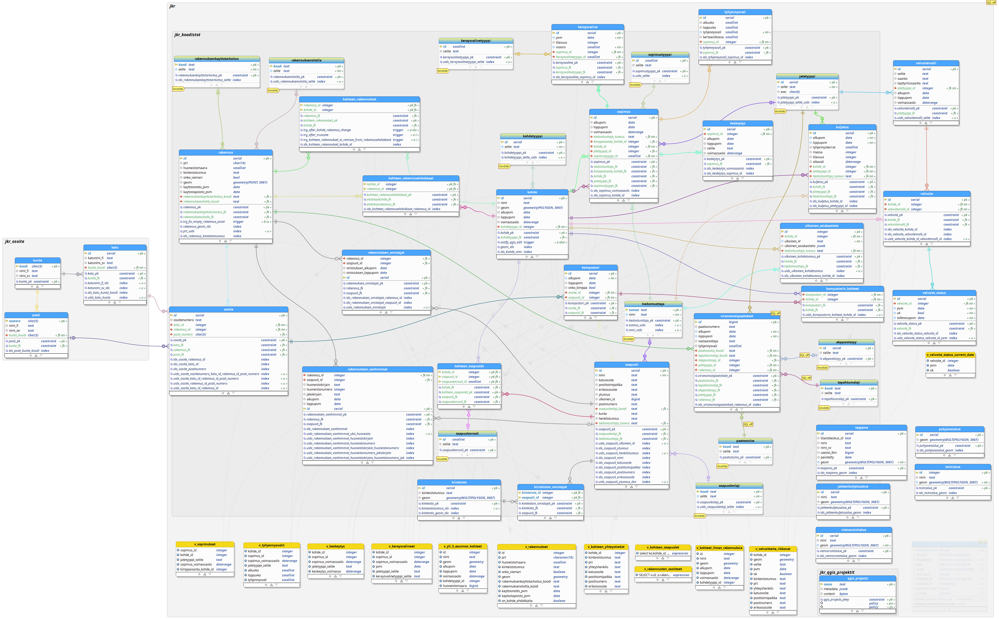

# Jkr-Lahti

Lahden seudun jätehuoltoviranomaisen jätehuollon seurantaan kehitettävä rekisteri (PostGIS/QGIS).

Toteutus 2022-2024

## Tietokantakuvaus


[docs/Lahti_jkr_db_model_7_2_2024.png](docs/Lahti_jkr_db_model_7_2_2024.png)


## Kehitysympäristön pystytys

```shell
git clone --recursive https://github.com/gispocoding/jkr-lahti
cd jkr-lahti
```
### Tietokannan käynnistys
```
docker compose -f .\jkr-core\docker-compose.yml -f .\docker-compose.yml --project-directory . up -d db
```
Tai vaihtoehtoisesti Windowsin Powershellissä
```
.\dc.ps1 up -d db
```

> dc.ps1 on "alias" yllämainitulle tarkemmalle `docker compose` kommennolle.

### Tietokantamigraatioiden ajaminen

```
.\dc.ps1 up flyway
.\dc.ps1 up flyway_lahti
```

> **Migraatioiden ajaminen toiseen ympäristöön**
> ```
> .\dc.ps1 run --rm flyway migrate -user=jkr_admin -password=<password> -url=jdbc:postgresql://<host>:<port>/<dbname>
> ```
