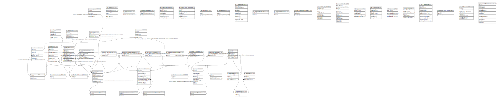

# JKR-Tietokanta

## Description

Jätteenkuljetusrekisterin tietokantamallin kuvaus

## Tables

| Name | Columns | Comment | Type |
| ---- | ------- | ------- | ---- |
| [jkr.kohde](jkr.kohde.md) | 7 | Kohteet sisältävä taulu. Kohde koostuu yhden omistajan hallinnoimista lähekkäisistä rakennuksista. Rakennukset voivat sijaita myös eri kiinteistöillä. Yhdellä kiinteistöllä voi olla useita kohteita. | BASE TABLE |
| [jkr.velvoitemalli](jkr.velvoitemalli.md) | 8 | Taulu, joka sisältää eri velvoitteet, ja niiden voimassaoloajan. Kullakin velvoitteella on näkymän ja funktion nimet, joilla velvoitteen täyttymistä voidaan seurata. | BASE TABLE |
| [jkr_koodistot.jatetyyppi](jkr_koodistot.jatetyyppi.md) | 3 | Taulu, joka sisältää mahdolliset jätetyypit | BASE TABLE |
| [jkr.velvoite](jkr.velvoite.md) | 3 | Taulu, joka sisältää kohteeseen liittyvät velvoitteet | BASE TABLE |
| [jkr.kiinteisto](jkr.kiinteisto.md) | 3 | Kiinteistöt sisältävä taulu | BASE TABLE |
| [jkr.osapuoli](jkr.osapuoli.md) | 10 | Kohteen, rakennuksen ja kiinteistön osapuolien tiedot sisältävä taulu | BASE TABLE |
| [jkr.rakennus](jkr.rakennus.md) | 10 | Rakennukset sisältävä taulu | BASE TABLE |
| [jkr.kuljetus](jkr.kuljetus.md) | 10 | Taulu, joka sisältää 4 kertaa vuodessa toimitettavat kuljetustiedot | BASE TABLE |
| [jkr.keraysvaline](jkr.keraysvaline.md) | 6 | Taulu, joka sisältää tiedot sopimukseen liittyvistä keräysvälineistä. Jätteenkuljettajien on toimitettava neljä kertaa vuodessa tiedot kuljetukseen kuuluvien jäteastioiden ko'oista ja määristä jätelajeittain (esim. asiakkaalla xxx on 2 kpl 660 litran sekajäte-astioita ja 1 kpl 200 litran sekajäte-astioita sekä 1 kpl 200 litran metallinkeräysastioita) | BASE TABLE |
| [jkr.taajama](jkr.taajama.md) | 7 | Taajamien aluerajaus.<br>Käytetään biojätteen keräysvelvoitteen selvittämiseen, eli rakennusten jotka sijaitsevat yli 10000 hengen taajamissa (keskustaajamat). | BASE TABLE |
| [jkr.pohjavesialue](jkr.pohjavesialue.md) | 2 | Pohjavesialueet sisältävä taulu | BASE TABLE |
| [jkr.jatteenkuljetusalue](jkr.jatteenkuljetusalue.md) | 3 | Jätteenkuljetusalueet sisältävä taulu.<br>Jätteenkuljetusalueiden ulkopuoliset kiinteistöt liittyvät aluejätekeräykseen. | BASE TABLE |
| [jkr.keskeytys](jkr.keskeytys.md) | 6 | Urakoitsijoille ilmoitetut alle vuoden keskeytykset. | BASE TABLE |
| [jkr.tyhjennysvali](jkr.tyhjennysvali.md) | 5 | Sopimukseen liittyvät tyhjennysvälitiedot sisältävä taulu | BASE TABLE |
| [jkr_osoite.katu](jkr_osoite.katu.md) | 4 | Katuosoitteen tiedot sisältävä taulu | BASE TABLE |
| [jkr.osoite](jkr.osoite.md) | 5 | Osoitetiedot sisältävä taulu | BASE TABLE |
| [jkr_osoite.kunta](jkr_osoite.kunta.md) | 3 | Osoitteeseen liittyvän kunnan tiedot sisältävä taulu | BASE TABLE |
| [jkr_koodistot.kohdetyyppi](jkr_koodistot.kohdetyyppi.md) | 2 | Koodistotaulu kohteen tyypille.<br>Kohdetyyppejä: Kiinteistö, Aluekeräyskohde, Pseudo aluekeräyskimppaisäntä | BASE TABLE |
| [jkr_koodistot.tiedontuottaja](jkr_koodistot.tiedontuottaja.md) | 2 | Taulu, joka sisältää mahdolliset tiedontuottajat | BASE TABLE |
| [jkr_osoite.posti](jkr_osoite.posti.md) | 4 | Postitoimipaikan tiedot sisältävä taulu | BASE TABLE |
| [jkr_koodistot.rakennuksenkayttotarkoitus](jkr_koodistot.rakennuksenkayttotarkoitus.md) | 2 | Taulu, joka sisältää mahdolliset rakennuksen käyttötarkoitukset | BASE TABLE |
| [jkr_koodistot.rakennuksenolotila](jkr_koodistot.rakennuksenolotila.md) | 2 | Taulu, joka sisältää mahdolliset rakennuksen olotilat | BASE TABLE |
| [jkr_koodistot.osapuolenlaji](jkr_koodistot.osapuolenlaji.md) | 2 | Taulu, joka sisältää mahdolliset osapuolen lajit | BASE TABLE |
| [jkr.sopimus](jkr.sopimus.md) | 9 | Taulu, joka sisältää tiedot kohteeseen liittyvistä sopimuksista | BASE TABLE |
| [jkr.ulkoinen_asiakastieto](jkr.ulkoinen_asiakastieto.md) | 5 | Kohteeseen liittyvää asiakastietoa ulkoisesta lähteestä (Facta, Dynasty, eri urakoitsijat). | BASE TABLE |
| [jkr_koodistot.osapuolenrooli](jkr_koodistot.osapuolenrooli.md) | 2 | Taulu sisältää koodiston kohteen osapuolen rooleille.<br>Rooleja on tällä hetkellä Asiakas ja Yhteystieto | BASE TABLE |
| [jkr.kohteen_osapuolet](jkr.kohteen_osapuolet.md) | 3 | Kohteen osapuolet sisältävä taulu | BASE TABLE |
| [jkr.kohteen_rakennukset](jkr.kohteen_rakennukset.md) | 2 | Kohteeseen liittyvät rakennukset sisältävä taulu | BASE TABLE |
| [jkr.rakennuksen_omistajat](jkr.rakennuksen_omistajat.md) | 2 | Rakennuksen omistajat sisältävä taulu | BASE TABLE |
| [jkr.kiinteiston_omistajat](jkr.kiinteiston_omistajat.md) | 2 | Kiinteistön omistajat sisältävä taulu | BASE TABLE |
| [jkr_koodistot.sopimustyyppi](jkr_koodistot.sopimustyyppi.md) | 2 | Koodistotaulu sopimustyypeille.<br>Sopimustyyppejä: Tyhjennyssopimus, Kimppasopimus, Aluekeräyssopimus | BASE TABLE |
| [jkr_koodistot.keraysvalinetyyppi](jkr_koodistot.keraysvalinetyyppi.md) | 2 | Taulu, joka sisältää mahdolliset keräysvälinetyypit | BASE TABLE |
| [jkr.v_rakennusten_osoitteet](jkr.v_rakennusten_osoitteet.md) | 7 | Näkymä joka kokoaa kullekin rakennukselle osoitetauluista tiedot yhteen | VIEW |
| [jkr.v_kohteet_ilman_rakennuksia](jkr.v_kohteet_ilman_rakennuksia.md) | 7 |  | VIEW |
| [jkr.toimialue](jkr.toimialue.md) | 3 | Viranomaisen toimialueen aluerajaus kunnittain.<br>Aluerajauksen avulla valitaan tutkittavaksi ainoastaan ne rakennukset/kiinteistöt, jotka sijaitseat aluerajauksen sisällä. | BASE TABLE |
| [jkr.viemarointialue](jkr.viemarointialue.md) | 3 | Aluerajaus, jolla on viemäröintiverkosto asennettu.<br>Käytetään valitsemaan ne rakennukset, joilla tulisi olla lietteen keräys säiliöt. | BASE TABLE |
| [jkr.v_kohteen_osapuolet](jkr.v_kohteen_osapuolet.md) | 11 | Näkymä joka "purkaa" kohteen osapuolten n:n relaation kullekin kohteelle 1:n relaatioksi. | VIEW |
| [jkr_koodistot.tapahtumalaji](jkr_koodistot.tapahtumalaji.md) | 2 |  | BASE TABLE |
| [jkr_koodistot.paatostulos](jkr_koodistot.paatostulos.md) | 2 |  | BASE TABLE |
| [jkr.kohteen_rakennusehdokkaat](jkr.kohteen_rakennusehdokkaat.md) | 2 | Jos kohteelle ei voida yksiselitteisesti kohdentaa rakennuksia, niin lisätään kohteelle mahdolliset rakennukset tähän tauluun. | BASE TABLE |
| [jkr_qgis_projektit.qgis_projects](jkr_qgis_projektit.qgis_projects.md) | 3 | QGIS-projektit sisältävä taulu | BASE TABLE |
| [jkr.velvoite_status](jkr.velvoite_status.md) | 5 | Taulu sisältää tallennetut tilanteet kohteen velvollisuuksille.<br>Velvoitteen tilanteet voidaan tallentaa tietylle päivämäärälle kyselyllä<br>```sql<br>select tallenna_velvoite_status('2020-3-1');<br>``` | BASE TABLE |
| [jkr.v_kohteen_yhteystiedot](jkr.v_kohteen_yhteystiedot.md) | 8 |  | VIEW |
| [jkr.v_velvoitteita_rikkovat](jkr.v_velvoitteita_rikkovat.md) | 12 |  | VIEW |
| [jkr.v_sopimukset](jkr.v_sopimukset.md) | 5 | Apunäkymä velvoitekyselyille. Sisältää mm. jätetyypin selitteen. | VIEW |
| [jkr.v_tyhjennysvalit](jkr.v_tyhjennysvalit.md) | 7 | Apunäkymä velvoitekyselyille. Sisältää mm. jätetyypin selitteen ja sopimuksen voimassaoloajan. | VIEW |
| [jkr.v_keskeytys](jkr.v_keskeytys.md) | 5 | Apunäkymä velvoitekyselyille. Sisältää mm. jätetyypin selitteen ja sopimuksen voimassaoloajan. | VIEW |
| [jkr.v_keraysvalineet](jkr.v_keraysvalineet.md) | 6 | Apunäkymä velvoitekyselyille. Sisältää mm. jätetyypin selitteen ja sopimuksen voimassaoloajan. | VIEW |
| [jkr.v_rakennukset](jkr.v_rakennukset.md) | 11 | Rakennusnäkymä, joka sisältää kaikki jkr.rakennus-taulun kentät sekä generoidun kentän onko rakennukselle tyrkyllä kohteita. | VIEW |
| [jkr.v_velvoite_status_current_date](jkr.v_velvoite_status_current_date.md) | 3 |  | VIEW |
| [jkr.v_yli_5_asunnon_kohteet](jkr.v_yli_5_asunnon_kohteet.md) | 8 |  | VIEW |
| [jkr.viranomaispaatokset](jkr.viranomaispaatokset.md) | 13 |  | MATERIALIZED VIEW |

## Relations



---

> Generated by [tbls](https://github.com/k1LoW/tbls)
