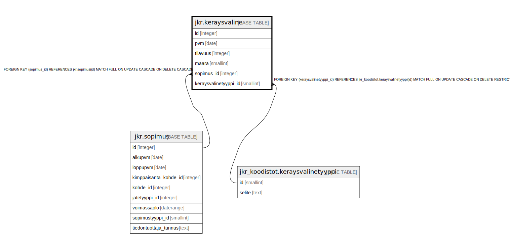

# jkr.keraysvaline

## Description

Taulu, joka sisältää tiedot sopimukseen liittyvistä keräysvälineistä. Jätteenkuljettajien on toimitettava neljä kertaa vuodessa tiedot kuljetukseen kuuluvien jäteastioiden ko'oista ja määristä jätelajeittain (esim. asiakkaalla xxx on 2 kpl 660 litran sekajäte-astioita ja 1 kpl 200 litran sekajäte-astioita sekä 1 kpl 200 litran metallinkeräysastioita)

## Columns

| Name | Type | Default | Nullable | Children | Parents | Comment |
| ---- | ---- | ------- | -------- | -------- | ------- | ------- |
| id | integer | nextval('jkr.keraysvaline_id_seq'::regclass) | false |  |  |  |
| pvm | date |  | false |  |  | Päivämäärä, jolloin kuljettajat ovat keränneet raportoitavat tiedot |
| tilavuus | integer |  | true |  |  | Keräysväline(id)en tilavuus litroina |
| maara | smallint |  | false |  |  | Keräysvälineiden lukumäärä |
| sopimus_id | integer |  | false |  | [jkr.sopimus](jkr.sopimus.md) |  |
| keraysvalinetyyppi_id | smallint |  | true |  | [jkr_koodistot.keraysvalinetyyppi](jkr_koodistot.keraysvalinetyyppi.md) |  |

## Constraints

| Name | Type | Definition |
| ---- | ---- | ---------- |
| keraysvaline_pk | PRIMARY KEY | PRIMARY KEY (id) |
| sopimus_fk | FOREIGN KEY | FOREIGN KEY (sopimus_id) REFERENCES jkr.sopimus(id) MATCH FULL ON UPDATE CASCADE ON DELETE CASCADE |
| keraysvalinetyyppi_fk | FOREIGN KEY | FOREIGN KEY (keraysvalinetyyppi_id) REFERENCES jkr_koodistot.keraysvalinetyyppi(id) MATCH FULL ON UPDATE CASCADE ON DELETE RESTRICT |

## Indexes

| Name | Definition |
| ---- | ---------- |
| keraysvaline_pk | CREATE UNIQUE INDEX keraysvaline_pk ON jkr.keraysvaline USING btree (id) |
| idx_keraysvaline_sopimus_id | CREATE INDEX idx_keraysvaline_sopimus_id ON jkr.keraysvaline USING btree (sopimus_id) |

## Relations

---

> Generated by [tbls](https://github.com/k1LoW/tbls)
