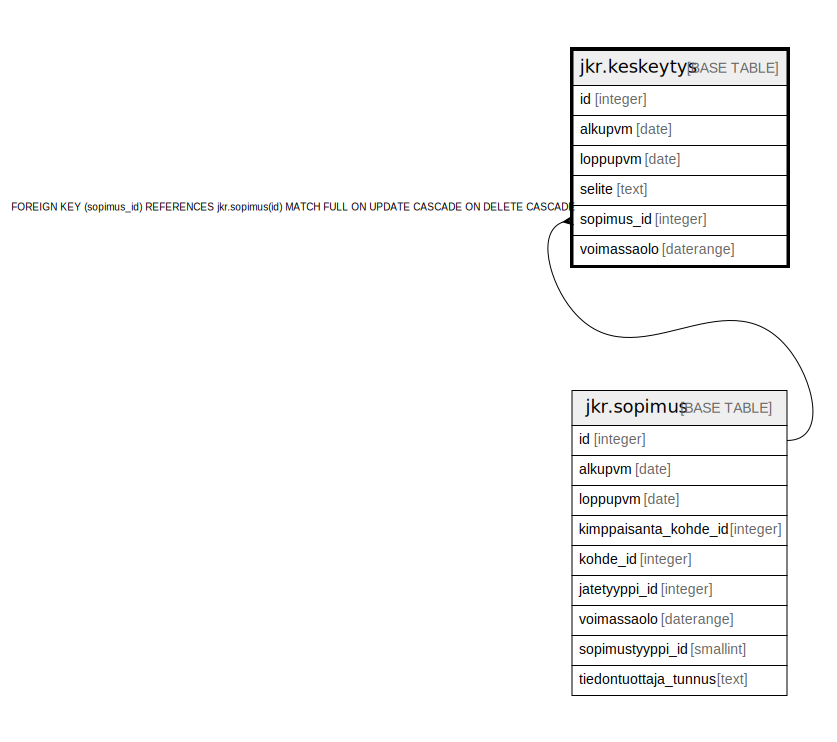

# jkr.keskeytys

## Description

Urakoitsijoille ilmoitetut alle vuoden keskeytykset.

## Columns

| Name | Type | Default | Nullable | Extra Definition | Children | Parents | Comment |
| ---- | ---- | ------- | -------- | ---------------- | -------- | ------- | ------- |
| id | integer | nextval('jkr.keskeytys_id_seq'::regclass) | false |  |  |  |  |
| alkupvm | date |  | true |  |  |  | Keskeytyksen alkamispäivämäärä |
| loppupvm | date |  | true |  |  |  | Keskeytyksen päättymispäivämäärä |
| selite | text |  | true |  |  |  | Mahdollinen selite keskeytykselle |
| sopimus_id | integer |  | false |  |  | [jkr.sopimus](jkr.sopimus.md) |  |
| voimassaolo | daterange |  | true | GENERATED ALWAYS AS daterange(COALESCE(alkupvm, '-infinity'::date), COALESCE(loppupvm, 'infinity'::date), '[]'::text) STORED |  |  | Automaattisesti luotu aikaväli-kenttä keskeytyksen voimassaololle.<br>Helpottaa aikavälikyselyitä. Voidaan esimerkiksi tehdä kysely<br>```sql<br>select *<br>from jkr.keskeytys<br>where voimassaolo @> '2021-1-1'::date<br>```<br>eikä tarvitse tehdä monimutkaista<br>```sql<br>select *<br>from jkr.keskeytys<br>where<br>  (alkupvm is null OR alkupvm <= '2021-1-1'::date`)<br>  AND<br>  (loppupvm is null OR '2021-1-1'::date` <= loppupvm)<br>``` |

## Constraints

| Name | Type | Definition |
| ---- | ---- | ---------- |
| keskeytys_pk | PRIMARY KEY | PRIMARY KEY (id) |
| sopimus_fk | FOREIGN KEY | FOREIGN KEY (sopimus_id) REFERENCES jkr.sopimus(id) MATCH FULL ON UPDATE CASCADE ON DELETE CASCADE |

## Indexes

| Name | Definition |
| ---- | ---------- |
| keskeytys_pk | CREATE UNIQUE INDEX keskeytys_pk ON jkr.keskeytys USING btree (id) |
| idx_keskeytys_sopimus_id | CREATE INDEX idx_keskeytys_sopimus_id ON jkr.keskeytys USING btree (sopimus_id) |
| idx_keskeytys_voimassaolo | CREATE INDEX idx_keskeytys_voimassaolo ON jkr.keskeytys USING gist (voimassaolo) |

## Relations



---

> Generated by [tbls](https://github.com/k1LoW/tbls)
