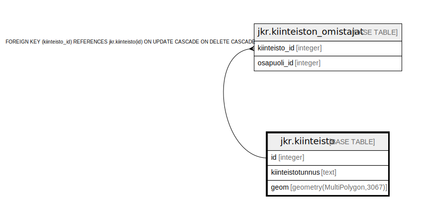

# jkr.kiinteisto

## Description

Kiinteistöt sisältävä taulu

## Columns

| Name | Type | Default | Nullable | Children | Parents | Comment |
| ---- | ---- | ------- | -------- | -------- | ------- | ------- |
| id | integer | nextval('jkr.kiinteisto_id_seq'::regclass) | false | [jkr.kiinteiston_omistajat](jkr.kiinteiston_omistajat.md) |  |  |
| kiinteistotunnus | text |  | true |  |  | Tekstimuotoinen kiinteistötunnus |
| geom | geometry(MultiPolygon,3067) |  | true |  |  | Kiinteistön geometria |

## Constraints

| Name | Type | Definition |
| ---- | ---- | ---------- |
| kiinteisto_pk | PRIMARY KEY | PRIMARY KEY (id) |

## Indexes

| Name | Definition |
| ---- | ---------- |
| kiinteisto_pk | CREATE UNIQUE INDEX kiinteisto_pk ON jkr.kiinteisto USING btree (id) |
| kiinteistotunnus_idx | CREATE UNIQUE INDEX kiinteistotunnus_idx ON jkr.kiinteisto USING btree (kiinteistotunnus) |
| kiinteisto_geom_idx | CREATE INDEX kiinteisto_geom_idx ON jkr.kiinteisto USING gist (geom) |

## Relations

---

> Generated by [tbls](https://github.com/k1LoW/tbls)
