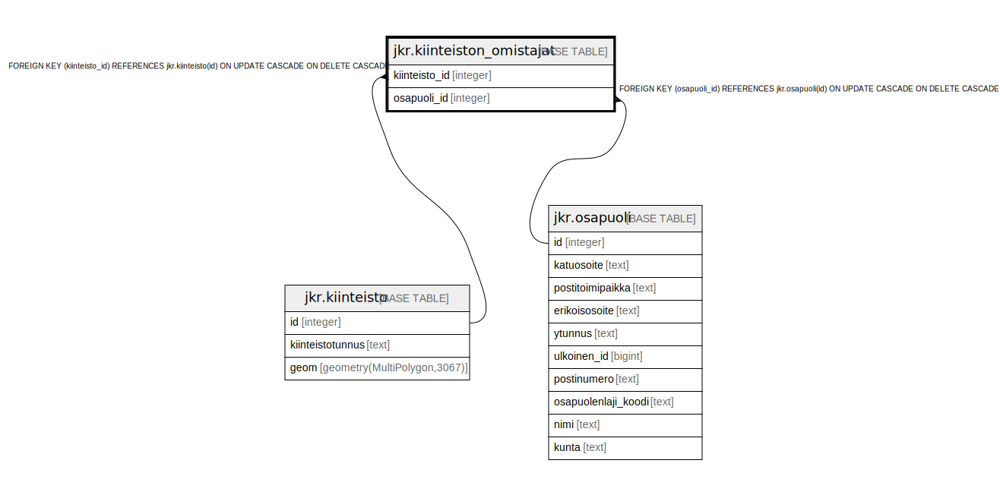

# jkr.kiinteiston_omistajat

## Description

Kiinteistön omistajat sisältävä taulu

## Columns

| Name | Type | Default | Nullable | Children | Parents | Comment |
| ---- | ---- | ------- | -------- | -------- | ------- | ------- |
| kiinteisto_id | integer |  | false |  | [jkr.kiinteisto](jkr.kiinteisto.md) | Kiinteistön yksilöivä sarjanumeromuotoinen tunniste |
| osapuoli_id | integer |  | false |  | [jkr.osapuoli](jkr.osapuoli.md) | Osapuolen yksilöivä sarjanumeromuotoinen tunniste |

## Constraints

| Name | Type | Definition |
| ---- | ---- | ---------- |
| kiinteisto_fk | FOREIGN KEY | FOREIGN KEY (kiinteisto_id) REFERENCES jkr.kiinteisto(id) ON UPDATE CASCADE ON DELETE CASCADE |
| osapuoli_fk | FOREIGN KEY | FOREIGN KEY (osapuoli_id) REFERENCES jkr.osapuoli(id) ON UPDATE CASCADE ON DELETE CASCADE |
| kiinteiston_omistajat_pk | PRIMARY KEY | PRIMARY KEY (kiinteisto_id, osapuoli_id) |

## Indexes

| Name | Definition |
| ---- | ---------- |
| kiinteiston_omistajat_pk | CREATE UNIQUE INDEX kiinteiston_omistajat_pk ON jkr.kiinteiston_omistajat USING btree (kiinteisto_id, osapuoli_id) |

## Relations

---

> Generated by [tbls](https://github.com/k1LoW/tbls)
