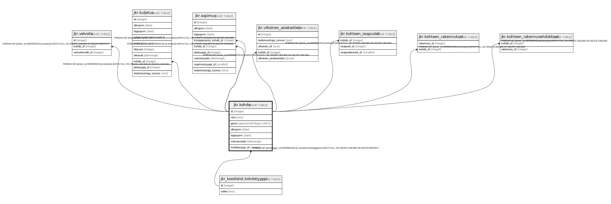

# jkr.kohde

## Description

Kohteet sisältävä taulu. Kohde koostuu yhden omistajan hallinnoimista lähekkäisistä rakennuksista. Rakennukset voivat sijaita myös eri kiinteistöillä. Yhdellä kiinteistöllä voi olla useita kohteita.

## Columns

| Name | Type | Default | Nullable | Extra Definition | Children | Parents | Comment |
| ---- | ---- | ------- | -------- | ---------------- | -------- | ------- | ------- |
| id | integer | nextval('jkr.kohde_id_seq'::regclass) | false |  | [jkr.velvoite](jkr.velvoite.md) [jkr.kuljetus](jkr.kuljetus.md) [jkr.sopimus](jkr.sopimus.md) [jkr.ulkoinen_asiakastieto](jkr.ulkoinen_asiakastieto.md) [jkr.kohteen_osapuolet](jkr.kohteen_osapuolet.md) [jkr.kohteen_rakennukset](jkr.kohteen_rakennukset.md) [jkr.kohteen_rakennusehdokkaat](jkr.kohteen_rakennusehdokkaat.md) |  |  |
| nimi | text |  | true |  |  |  | Kohteen nimi |
| geom | geometry(Polygon,3067) |  | true |  |  |  | Kohteen pseudogeometria. Generoidaan automaattisesti (konveksi peite kohteeseen kuuluvista rakennuksista) |
| alkupvm | date |  | true |  |  |  | Kohteen jätehuoltovelvollisuuden alkupäivämäärä. Käytännössä milloin asiakas on muuttanut rakennukseen |
| loppupvm | date |  | true |  |  |  | Kohteen jätehuoltovelvollisuuden loppupäivämäärä. Käytännössä milloin asiakas on muuttanut pois rakennuksesta |
| voimassaolo | daterange |  | true | GENERATED ALWAYS AS daterange(COALESCE(alkupvm, '-infinity'::date), COALESCE(loppupvm, 'infinity'::date), '[]'::text) STORED |  |  | Kohteen jätehuoltovelvollisuuden voimassaoloaikaväli. Oletusarvo johdetaan lausekkeella muiden sarakkeiden arvoista |
| kohdetyyppi_id | integer |  | false |  |  | [jkr_koodistot.kohdetyyppi](jkr_koodistot.kohdetyyppi.md) |  |

## Constraints

| Name | Type | Definition |
| ---- | ---- | ---------- |
| kohde_pk | PRIMARY KEY | PRIMARY KEY (id) |
| kohdetyyppi_fk | FOREIGN KEY | FOREIGN KEY (kohdetyyppi_id) REFERENCES jkr_koodistot.kohdetyyppi(id) MATCH FULL ON UPDATE CASCADE ON DELETE RESTRICT |

## Indexes

| Name | Definition |
| ---- | ---------- |
| kohde_pk | CREATE UNIQUE INDEX kohde_pk ON jkr.kohde USING btree (id) |
| idx_kohde_nimi | CREATE INDEX idx_kohde_nimi ON jkr.kohde USING btree (nimi) |
| geom_idx | CREATE INDEX geom_idx ON jkr.kohde USING gist (geom) |

## Triggers

| Name | Definition | Comment |
| ---- | ---------- | ------- |
| notify_qgis_edit | CREATE TRIGGER notify_qgis_edit AFTER INSERT OR DELETE OR UPDATE OR TRUNCATE ON jkr.kohde FOR EACH STATEMENT EXECUTE FUNCTION jkr.qgis_notify() | Triggeri, joka aktivoituu kun uusi kohde luodaan, kohdetta muokataan, kohde poistetaan tai kaikki kohteet poistetaan. Triggeri käynnistää qgis_notify-nimisen funktion |

## Relations

---

> Generated by [tbls](https://github.com/k1LoW/tbls)
