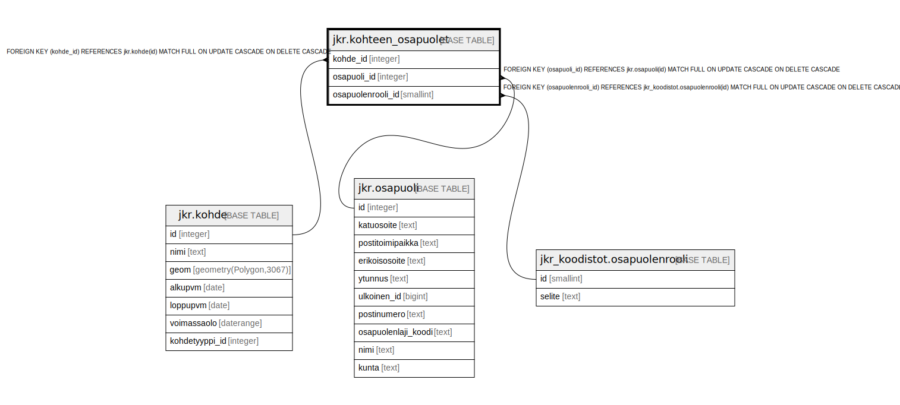

# jkr.kohteen_osapuolet

## Description

Kohteen osapuolet sisältävä taulu

## Columns

| Name | Type | Default | Nullable | Children | Parents | Comment |
| ---- | ---- | ------- | -------- | -------- | ------- | ------- |
| kohde_id | integer |  | false |  | [jkr.kohde](jkr.kohde.md) |  |
| osapuoli_id | integer |  | false |  | [jkr.osapuoli](jkr.osapuoli.md) |  |
| osapuolenrooli_id | smallint |  | true |  | [jkr_koodistot.osapuolenrooli](jkr_koodistot.osapuolenrooli.md) |  |

## Constraints

| Name | Type | Definition |
| ---- | ---- | ---------- |
| kohde_fk | FOREIGN KEY | FOREIGN KEY (kohde_id) REFERENCES jkr.kohde(id) MATCH FULL ON UPDATE CASCADE ON DELETE CASCADE |
| osapuoli_fk | FOREIGN KEY | FOREIGN KEY (osapuoli_id) REFERENCES jkr.osapuoli(id) MATCH FULL ON UPDATE CASCADE ON DELETE CASCADE |
| osapuolenrooli_fk | FOREIGN KEY | FOREIGN KEY (osapuolenrooli_id) REFERENCES jkr_koodistot.osapuolenrooli(id) MATCH FULL ON UPDATE CASCADE ON DELETE CASCADE |
| kohteen_osapuolet_pk | PRIMARY KEY | PRIMARY KEY (kohde_id, osapuoli_id) |

## Indexes

| Name | Definition |
| ---- | ---------- |
| kohteen_osapuolet_pk | CREATE UNIQUE INDEX kohteen_osapuolet_pk ON jkr.kohteen_osapuolet USING btree (kohde_id, osapuoli_id) |

## Relations

---

> Generated by [tbls](https://github.com/k1LoW/tbls)
