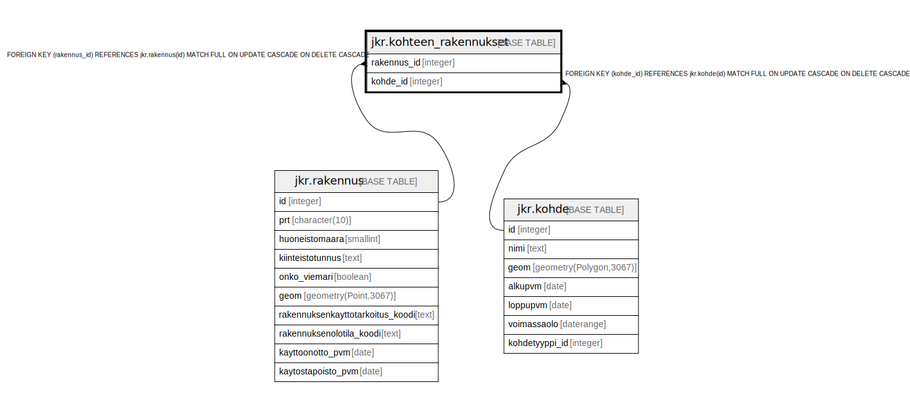

# jkr.kohteen_rakennukset

## Description

Kohteeseen liittyvät rakennukset sisältävä taulu

## Columns

| Name | Type | Default | Nullable | Children | Parents | Comment |
| ---- | ---- | ------- | -------- | -------- | ------- | ------- |
| rakennus_id | integer |  | false |  | [jkr.rakennus](jkr.rakennus.md) |  |
| kohde_id | integer |  | false |  | [jkr.kohde](jkr.kohde.md) |  |

## Constraints

| Name | Type | Definition |
| ---- | ---- | ---------- |
| kohde_fk | FOREIGN KEY | FOREIGN KEY (kohde_id) REFERENCES jkr.kohde(id) MATCH FULL ON UPDATE CASCADE ON DELETE CASCADE |
| rakennus_fk | FOREIGN KEY | FOREIGN KEY (rakennus_id) REFERENCES jkr.rakennus(id) MATCH FULL ON UPDATE CASCADE ON DELETE CASCADE |
| kohteen_rakennukset_pk | PRIMARY KEY | PRIMARY KEY (rakennus_id, kohde_id) |

## Indexes

| Name | Definition |
| ---- | ---------- |
| kohteen_rakennukset_pk | CREATE UNIQUE INDEX kohteen_rakennukset_pk ON jkr.kohteen_rakennukset USING btree (rakennus_id, kohde_id) |
| idx_kohteen_rakennukset_kohde_id | CREATE INDEX idx_kohteen_rakennukset_kohde_id ON jkr.kohteen_rakennukset USING btree (kohde_id) |

## Triggers

| Name | Definition | Comment |
| ---- | ---------- | ------- |
| trg_after_kohde_rakennus_change | CREATE TRIGGER trg_after_kohde_rakennus_change AFTER INSERT OR DELETE OR UPDATE ON jkr.kohteen_rakennukset FOR EACH ROW EXECUTE FUNCTION jkr.update_kohde_geom() | Triggeri, joka aktivoituu kun kohteelle on lisätty rakennus, kohteeseen liittyvien rakennusten listaa on päivitetty tai jokin kohteeseen liittyvistä rakennuksista on poistettu. Triggeri käynnistää update_kohde_geom-nimisen funktion |
| trg_after_truncate | CREATE TRIGGER trg_after_truncate AFTER TRUNCATE ON jkr.kohteen_rakennukset FOR EACH STATEMENT EXECUTE FUNCTION jkr.update_kohde_geom() | Triggeri, joka aktivoituu kun kohteelta poistetaan kaikki rakennukset. Triggeri käynnistää update_kohde_geom-nimisen funktion |
| trg_kohteen_rakennukset_ai_remove_from_rakennusehdokkaat | CREATE TRIGGER trg_kohteen_rakennukset_ai_remove_from_rakennusehdokkaat AFTER INSERT ON jkr.kohteen_rakennukset FOR EACH ROW EXECUTE FUNCTION jkr.trg_kohteen_rakennukset_ai_remove_from_rakennusehdokkaat() |  |

## Relations

---

> Generated by [tbls](https://github.com/k1LoW/tbls)
