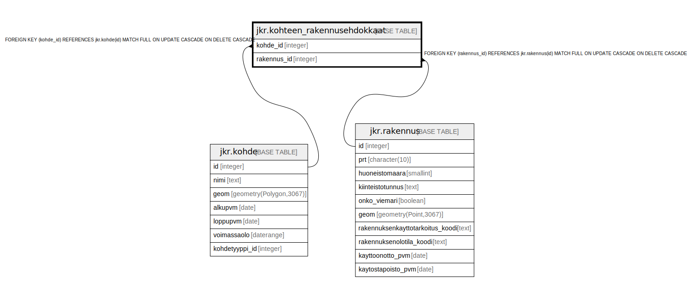

# jkr.kohteen_rakennusehdokkaat

## Description

Jos kohteelle ei voida yksiselitteisesti kohdentaa rakennuksia, niin lisätään kohteelle mahdolliset rakennukset tähän tauluun.

## Columns

| Name | Type | Default | Nullable | Children | Parents | Comment |
| ---- | ---- | ------- | -------- | -------- | ------- | ------- |
| kohde_id | integer |  | false |  | [jkr.kohde](jkr.kohde.md) |  |
| rakennus_id | integer |  | false |  | [jkr.rakennus](jkr.rakennus.md) |  |

## Constraints

| Name | Type | Definition |
| ---- | ---- | ---------- |
| ehdokaskohde_fk | FOREIGN KEY | FOREIGN KEY (kohde_id) REFERENCES jkr.kohde(id) MATCH FULL ON UPDATE CASCADE ON DELETE CASCADE |
| ehdokasrakennus_fk | FOREIGN KEY | FOREIGN KEY (rakennus_id) REFERENCES jkr.rakennus(id) MATCH FULL ON UPDATE CASCADE ON DELETE CASCADE |
| kohteen_rakennusehdokkaat_pk | PRIMARY KEY | PRIMARY KEY (kohde_id, rakennus_id) |

## Indexes

| Name | Definition |
| ---- | ---------- |
| kohteen_rakennusehdokkaat_pk | CREATE UNIQUE INDEX kohteen_rakennusehdokkaat_pk ON jkr.kohteen_rakennusehdokkaat USING btree (kohde_id, rakennus_id) |
| idx_kohteen_rakennusehdokkaat_rakennus_id | CREATE INDEX idx_kohteen_rakennusehdokkaat_rakennus_id ON jkr.kohteen_rakennusehdokkaat USING btree (rakennus_id) |

## Relations

---

> Generated by [tbls](https://github.com/k1LoW/tbls)
