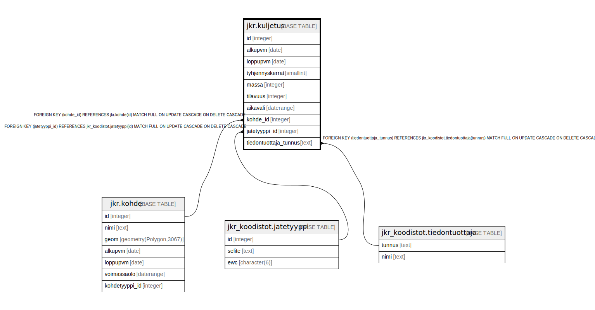

# jkr.kuljetus

## Description

Taulu, joka sisältää 4 kertaa vuodessa toimitettavat kuljetustiedot

## Columns

| Name | Type | Default | Nullable | Extra Definition | Children | Parents | Comment |
| ---- | ---- | ------- | -------- | ---------------- | -------- | ------- | ------- |
| id | integer | nextval('jkr.kuljetus_id_seq'::regclass) | false |  |  |  |  |
| alkupvm | date |  | false |  |  |  | Kujetustapahtumien raportointiaikavälin alkamispäivämäärä |
| loppupvm | date |  | false |  |  |  | Kujetustapahtumien raportointiaikavälin päättymispäivämäärä |
| tyhjennyskerrat | smallint |  | true |  |  |  | Raportointiaikavälin aikana suoritettujen kuljetusten lukumäärä |
| massa | integer |  | true |  |  |  | Raportointiaikavälin aikana suoritettujen kuljetusten sisältämä massa kilogrammoina |
| tilavuus | integer |  | true |  |  |  | Raportointiaikavälin aikana suoritettujen kuljetusten sisältämä tilavuus litroina |
| aikavali | daterange |  | true | GENERATED ALWAYS AS daterange(COALESCE(alkupvm, '-infinity'::date), COALESCE(loppupvm, 'infinity'::date), '[]'::text) STORED |  |  | Kuljetustapahtumien raportointiaikaväli. Oletusarvo johdetaan lausekkeella muiden sarakkeiden arvoista |
| kohde_id | integer |  | false |  |  | [jkr.kohde](jkr.kohde.md) |  |
| jatetyyppi_id | integer |  | false |  |  | [jkr_koodistot.jatetyyppi](jkr_koodistot.jatetyyppi.md) |  |
| tiedontuottaja_tunnus | text |  | false |  |  | [jkr_koodistot.tiedontuottaja](jkr_koodistot.tiedontuottaja.md) |  |

## Constraints

| Name | Type | Definition |
| ---- | ---- | ---------- |
| kohde_fk | FOREIGN KEY | FOREIGN KEY (kohde_id) REFERENCES jkr.kohde(id) MATCH FULL ON UPDATE CASCADE ON DELETE CASCADE |
| jatetyyppi_fk | FOREIGN KEY | FOREIGN KEY (jatetyyppi_id) REFERENCES jkr_koodistot.jatetyyppi(id) MATCH FULL ON UPDATE CASCADE ON DELETE CASCADE |
| kuljetus_pk | PRIMARY KEY | PRIMARY KEY (id) |
| tiedontuottaja_fk | FOREIGN KEY | FOREIGN KEY (tiedontuottaja_tunnus) REFERENCES jkr_koodistot.tiedontuottaja(tunnus) MATCH FULL ON UPDATE CASCADE ON DELETE CASCADE |

## Indexes

| Name | Definition |
| ---- | ---------- |
| kuljetus_pk | CREATE UNIQUE INDEX kuljetus_pk ON jkr.kuljetus USING btree (id) |
| idx_kuljetus_kohde_id | CREATE INDEX idx_kuljetus_kohde_id ON jkr.kuljetus USING btree (kohde_id) |
| idx_kuljetus_jatetyyppi_id | CREATE INDEX idx_kuljetus_jatetyyppi_id ON jkr.kuljetus USING btree (jatetyyppi_id) |

## Relations

---

> Generated by [tbls](https://github.com/k1LoW/tbls)
