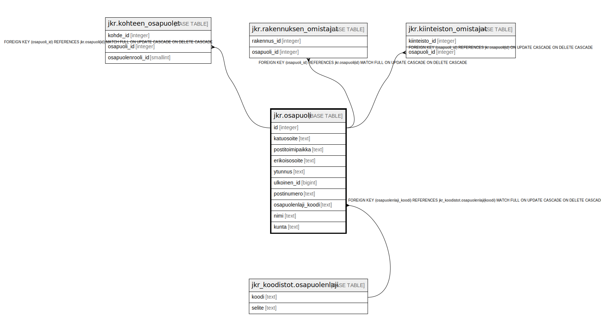

# jkr.osapuoli

## Description

Kohteen, rakennuksen ja kiinteistön osapuolien tiedot sisältävä taulu

## Columns

| Name | Type | Default | Nullable | Children | Parents | Comment |
| ---- | ---- | ------- | -------- | -------- | ------- | ------- |
| id | integer | nextval('jkr.osapuoli_id_seq'::regclass) | false | [jkr.kohteen_osapuolet](jkr.kohteen_osapuolet.md) [jkr.rakennuksen_omistajat](jkr.rakennuksen_omistajat.md) [jkr.kiinteiston_omistajat](jkr.kiinteiston_omistajat.md) |  |  |
| katuosoite | text |  | true |  |  | Katuosoite |
| postitoimipaikka | text |  | true |  |  | Postitoimipaikka |
| erikoisosoite | text |  | true |  |  | Ulkomaanosoitteet |
| ytunnus | text |  | true |  |  | Y-tunnus, jos osapuoli on yritys / yhteisö |
| ulkoinen_id | bigint |  | true |  |  | Vierasavain, jonka avulla voidaan yksilöidä ulkoisesta lähteestä tuotavat henkilötiedot. Estää sen, ettei päivittäessä tuoda jo olemassa olevia henkilöitä uudelleen. |
| postinumero | text |  | true |  |  | Postinumero |
| osapuolenlaji_koodi | text |  | true |  | [jkr_koodistot.osapuolenlaji](jkr_koodistot.osapuolenlaji.md) |  |
| nimi | text |  | false |  |  | Osapuolen nimi |
| kunta | text |  | true |  |  |  |

## Constraints

| Name | Type | Definition |
| ---- | ---- | ---------- |
| osapuoli_pk | PRIMARY KEY | PRIMARY KEY (id) |
| osapuolenlaji_fk | FOREIGN KEY | FOREIGN KEY (osapuolenlaji_koodi) REFERENCES jkr_koodistot.osapuolenlaji(koodi) MATCH FULL ON UPDATE CASCADE ON DELETE CASCADE |

## Indexes

| Name | Definition |
| ---- | ---------- |
| osapuoli_pk | CREATE UNIQUE INDEX osapuoli_pk ON jkr.osapuoli USING btree (id) |
| uidx_osapuoli_ulkoinen_id | CREATE UNIQUE INDEX uidx_osapuoli_ulkoinen_id ON jkr.osapuoli USING btree (ulkoinen_id) |
| idx_osapuoli_ytunnus | CREATE INDEX idx_osapuoli_ytunnus ON jkr.osapuoli USING btree (ytunnus) |

## Relations

---

> Generated by [tbls](https://github.com/k1LoW/tbls)
