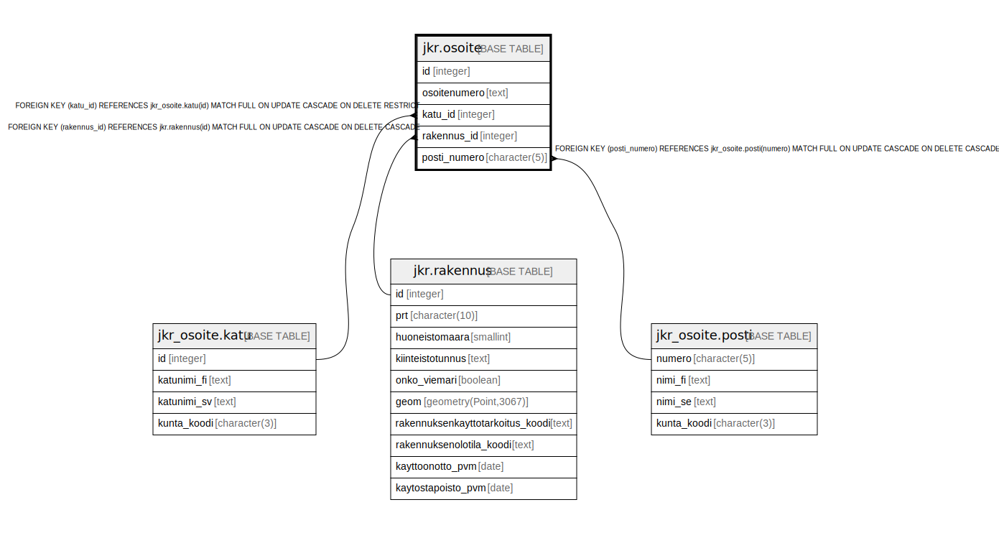

# jkr.osoite

## Description

Osoitetiedot sisältävä taulu

## Columns

| Name | Type | Default | Nullable | Children | Parents | Comment |
| ---- | ---- | ------- | -------- | -------- | ------- | ------- |
| id | integer | nextval('jkr.osoite_id_seq'::regclass) | false |  |  |  |
| osoitenumero | text |  | true |  |  | Katuosoitteeseen liittyvä talon ja/tai rapun ja/tai asunnon numero |
| katu_id | integer |  | false |  | [jkr_osoite.katu](jkr_osoite.katu.md) |  |
| rakennus_id | integer |  | false |  | [jkr.rakennus](jkr.rakennus.md) |  |
| posti_numero | character(5) |  | true |  | [jkr_osoite.posti](jkr_osoite.posti.md) |  |

## Constraints

| Name | Type | Definition |
| ---- | ---- | ---------- |
| rakennus_fk | FOREIGN KEY | FOREIGN KEY (rakennus_id) REFERENCES jkr.rakennus(id) MATCH FULL ON UPDATE CASCADE ON DELETE CASCADE |
| katu_fk | FOREIGN KEY | FOREIGN KEY (katu_id) REFERENCES jkr_osoite.katu(id) MATCH FULL ON UPDATE CASCADE ON DELETE RESTRICT |
| osoite_pk | PRIMARY KEY | PRIMARY KEY (id) |
| posti_fk | FOREIGN KEY | FOREIGN KEY (posti_numero) REFERENCES jkr_osoite.posti(numero) MATCH FULL ON UPDATE CASCADE ON DELETE CASCADE |

## Indexes

| Name | Definition |
| ---- | ---------- |
| osoite_pk | CREATE UNIQUE INDEX osoite_pk ON jkr.osoite USING btree (id) |
| idx_osoite_rakennus_id | CREATE INDEX idx_osoite_rakennus_id ON jkr.osoite USING btree (rakennus_id) |
| idx_osoite_katu_id | CREATE INDEX idx_osoite_katu_id ON jkr.osoite USING btree (katu_id) |
| idx_osoite_postinumero | CREATE INDEX idx_osoite_postinumero ON jkr.osoite USING btree (posti_numero) |

## Relations

---

> Generated by [tbls](https://github.com/k1LoW/tbls)
