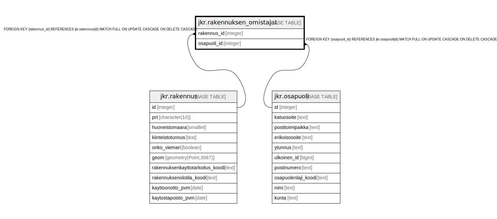

# jkr.rakennuksen_omistajat

## Description

Rakennuksen omistajat sisältävä taulu

## Columns

| Name | Type | Default | Nullable | Children | Parents | Comment |
| ---- | ---- | ------- | -------- | -------- | ------- | ------- |
| rakennus_id | integer |  | false |  | [jkr.rakennus](jkr.rakennus.md) | Rakennuksen yksilöivä sarjanumeromuotoinen tunniste |
| osapuoli_id | integer |  | false |  | [jkr.osapuoli](jkr.osapuoli.md) | Osapuolen yksilöivä sarjanumeromuotoinen tunniste |

## Constraints

| Name | Type | Definition |
| ---- | ---- | ---------- |
| osapuoli_fk | FOREIGN KEY | FOREIGN KEY (osapuoli_id) REFERENCES jkr.osapuoli(id) MATCH FULL ON UPDATE CASCADE ON DELETE CASCADE |
| rakennus_fk | FOREIGN KEY | FOREIGN KEY (rakennus_id) REFERENCES jkr.rakennus(id) MATCH FULL ON UPDATE CASCADE ON DELETE CASCADE |
| rakennuksen_omistajat_pk | PRIMARY KEY | PRIMARY KEY (rakennus_id, osapuoli_id) |

## Indexes

| Name | Definition |
| ---- | ---------- |
| rakennuksen_omistajat_pk | CREATE UNIQUE INDEX rakennuksen_omistajat_pk ON jkr.rakennuksen_omistajat USING btree (rakennus_id, osapuoli_id) |
| idx_rakennuksen_omistajat_osapuoli_id | CREATE INDEX idx_rakennuksen_omistajat_osapuoli_id ON jkr.rakennuksen_omistajat USING btree (osapuoli_id) |
| idx_rakennuksen_omistajat_rakennus_id | CREATE INDEX idx_rakennuksen_omistajat_rakennus_id ON jkr.rakennuksen_omistajat USING btree (rakennus_id) |

## Relations

---

> Generated by [tbls](https://github.com/k1LoW/tbls)
