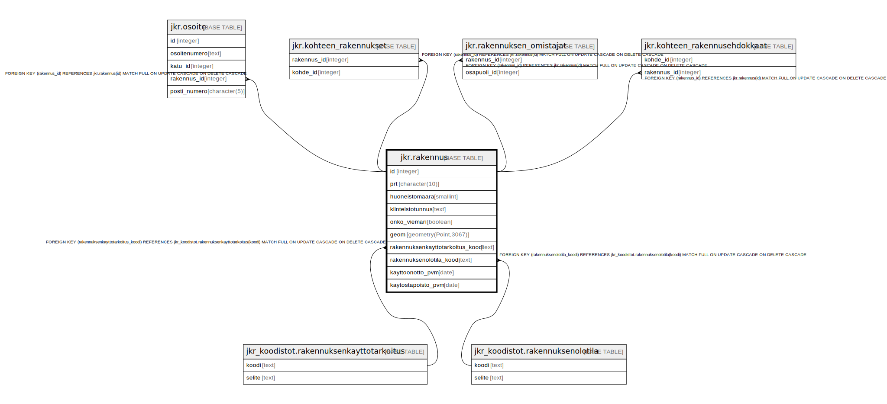

# jkr.rakennus

## Description

Rakennukset sisältävä taulu

## Columns

| Name | Type | Default | Nullable | Children | Parents | Comment |
| ---- | ---- | ------- | -------- | -------- | ------- | ------- |
| id | integer | nextval('jkr.rakennus_id_seq'::regclass) | false | [jkr.osoite](jkr.osoite.md) [jkr.kohteen_rakennukset](jkr.kohteen_rakennukset.md) [jkr.rakennuksen_omistajat](jkr.rakennuksen_omistajat.md) [jkr.kohteen_rakennusehdokkaat](jkr.kohteen_rakennusehdokkaat.md) |  |  |
| prt | character(10) |  | true |  |  | Yksilöivä 10-merkkinen rakennustunnus |
| huoneistomaara | smallint |  | true |  |  | Rakennukseen kuuluvien huoneistojen lukumäärä |
| kiinteistotunnus | text |  | true |  |  | Tekstimuotoinen kiinteistötunnus |
| onko_viemari | boolean |  | true |  |  | Totuusarvo, joka kertoo sen kuuluuko rakennus viemäriverkostoon vai ei |
| geom | geometry(Point,3067) |  | true |  |  | Rakennuksen geometria |
| rakennuksenkayttotarkoitus_koodi | text |  | true |  | [jkr_koodistot.rakennuksenkayttotarkoitus](jkr_koodistot.rakennuksenkayttotarkoitus.md) |  |
| rakennuksenolotila_koodi | text |  | true |  | [jkr_koodistot.rakennuksenolotila](jkr_koodistot.rakennuksenolotila.md) |  |
| kayttoonotto_pvm | date |  | true |  |  | Rakennuksen käyttöönottopäivämäärä |
| kaytostapoisto_pvm | date |  | true |  |  | Rakennuksen käytöstäpoistopäivämäärä |

## Constraints

| Name | Type | Definition |
| ---- | ---- | ---------- |
| rakennus_pk | PRIMARY KEY | PRIMARY KEY (id) |
| rakennuksenkayttotarkoitus_fk | FOREIGN KEY | FOREIGN KEY (rakennuksenkayttotarkoitus_koodi) REFERENCES jkr_koodistot.rakennuksenkayttotarkoitus(koodi) MATCH FULL ON UPDATE CASCADE ON DELETE CASCADE |
| rakennuksenolotila_fk | FOREIGN KEY | FOREIGN KEY (rakennuksenolotila_koodi) REFERENCES jkr_koodistot.rakennuksenolotila(koodi) MATCH FULL ON UPDATE CASCADE ON DELETE CASCADE |

## Indexes

| Name | Definition |
| ---- | ---------- |
| rakennus_pk | CREATE UNIQUE INDEX rakennus_pk ON jkr.rakennus USING btree (id) |
| prt_uidx | CREATE UNIQUE INDEX prt_uidx ON jkr.rakennus USING btree (prt) |
| idx_rakennus_kiinteistotunnus | CREATE INDEX idx_rakennus_kiinteistotunnus ON jkr.rakennus USING btree (kiinteistotunnus) |
| rakennus_geom_idx | CREATE INDEX rakennus_geom_idx ON jkr.rakennus USING gist (geom) |

## Triggers

| Name | Definition | Comment |
| ---- | ---------- | ------- |
| trg_fix_empty_rakennus_point | CREATE TRIGGER trg_fix_empty_rakennus_point BEFORE INSERT OR UPDATE ON jkr.rakennus FOR EACH ROW EXECUTE FUNCTION jkr.fix_empty_point() | Factan Oraclesta tulevien rakennusgeometrioiden siivousta varten korjataan tyhjät geometriat ennen inserttiä ja updatea. |

## Relations

---

> Generated by [tbls](https://github.com/k1LoW/tbls)
