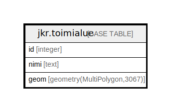

# jkr.toimialue

## Description

Viranomaisen toimialueen aluerajaus kunnittain.  
Aluerajauksen avulla valitaan tutkittavaksi ainoastaan ne rakennukset/kiinteistöt, jotka sijaitseat aluerajauksen sisällä.

## Columns

| Name | Type | Default | Nullable | Children | Parents | Comment |
| ---- | ---- | ------- | -------- | -------- | ------- | ------- |
| id | integer |  | false |  |  |  |
| nimi | text |  | true |  |  |  |
| geom | geometry(MultiPolygon,3067) |  | false |  |  |  |

## Constraints

| Name | Type | Definition |
| ---- | ---- | ---------- |
| toimialue_pk | PRIMARY KEY | PRIMARY KEY (id) |

## Indexes

| Name | Definition |
| ---- | ---------- |
| toimialue_pk | CREATE UNIQUE INDEX toimialue_pk ON jkr.toimialue USING btree (id) |
| idx_toimialue_geom | CREATE INDEX idx_toimialue_geom ON jkr.toimialue USING gist (geom) |

## Relations

---

> Generated by [tbls](https://github.com/k1LoW/tbls)
