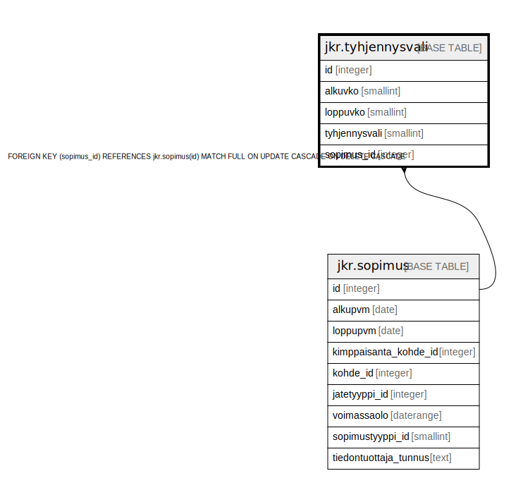

# jkr.tyhjennysvali

## Description

Sopimukseen liittyvät tyhjennysvälitiedot sisältävä taulu

## Columns

| Name | Type | Default | Nullable | Children | Parents | Comment |
| ---- | ---- | ------- | -------- | -------- | ------- | ------- |
| id | integer | nextval('jkr.tyhjennysvali_id_seq'::regclass) | false |  |  |  |
| alkuvko | smallint | 1 | true |  |  | Viikkonumero, josta alkaen astiat tyhjennetään X viikon välein. Oletusarvo on se, että tyhjennysväli asetetaan vuodeksi kerrallaan (eli alkaa vuoden ensimmäisestä viikosta) |
| loppuvko | smallint | 53 | true |  |  | Viikkonumero, johon päättyy astioiden tyhjentäminen X viikon välein. Oletusarvo on se, että tyhjennysväli asetetaan vuodeksi kerrallaan (eli päättyy vuoden viimeisenä viikkona) |
| tyhjennysvali | smallint |  | false |  |  | Tyhjennysväli viikoissa |
| sopimus_id | integer |  | false |  | [jkr.sopimus](jkr.sopimus.md) |  |

## Constraints

| Name | Type | Definition |
| ---- | ---- | ---------- |
| tyhjennysvali_pk | PRIMARY KEY | PRIMARY KEY (id) |
| sopimus_fk | FOREIGN KEY | FOREIGN KEY (sopimus_id) REFERENCES jkr.sopimus(id) MATCH FULL ON UPDATE CASCADE ON DELETE CASCADE |

## Indexes

| Name | Definition |
| ---- | ---------- |
| tyhjennysvali_pk | CREATE UNIQUE INDEX tyhjennysvali_pk ON jkr.tyhjennysvali USING btree (id) |
| idx_tyhjennysvali_sopimus_id | CREATE INDEX idx_tyhjennysvali_sopimus_id ON jkr.tyhjennysvali USING btree (sopimus_id) |

## Relations

---

> Generated by [tbls](https://github.com/k1LoW/tbls)
