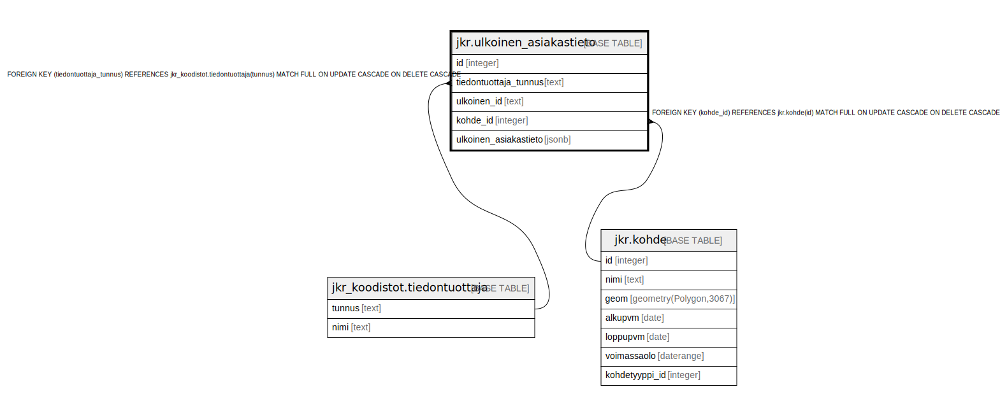

# jkr.ulkoinen_asiakastieto

## Description

Kohteeseen liittyvää asiakastietoa ulkoisesta lähteestä (Facta, Dynasty, eri urakoitsijat).

## Columns

| Name | Type | Default | Nullable | Children | Parents | Comment |
| ---- | ---- | ------- | -------- | -------- | ------- | ------- |
| id | integer |  | false |  |  | Taulun avaimena toimiva uniikki kokonaislukutunniste. Tunniste generoidaan automaattisesti |
| tiedontuottaja_tunnus | text |  | false |  | [jkr_koodistot.tiedontuottaja](jkr_koodistot.tiedontuottaja.md) |  |
| ulkoinen_id | text |  | false |  |  | Apu-id, jonka avulla saadaan haettua asiakkaiden tiedot kaikista muista järjestelmistä. Käytännössä asikasnumero kussakin ulkoisessa järjestelmässä |
| kohde_id | integer |  | false |  | [jkr.kohde](jkr.kohde.md) |  |
| ulkoinen_asiakastieto | jsonb |  | true |  |  | Mitä vain ulkoisesta järjestelmästä löytyvää tietoa asiakkaasta. Tallennetaan json-muodossa |

## Constraints

| Name | Type | Definition |
| ---- | ---- | ---------- |
| kohde_fk | FOREIGN KEY | FOREIGN KEY (kohde_id) REFERENCES jkr.kohde(id) MATCH FULL ON UPDATE CASCADE ON DELETE CASCADE |
| ulkoinen_kohdetunnus_pk | PRIMARY KEY | PRIMARY KEY (id) |
| tiedontuottaja_fk | FOREIGN KEY | FOREIGN KEY (tiedontuottaja_tunnus) REFERENCES jkr_koodistot.tiedontuottaja(tunnus) MATCH FULL ON UPDATE CASCADE ON DELETE CASCADE |

## Indexes

| Name | Definition |
| ---- | ---------- |
| ulkoinen_kohdetunnus_pk | CREATE UNIQUE INDEX ulkoinen_kohdetunnus_pk ON jkr.ulkoinen_asiakastieto USING btree (id) |
| idx_ulkoinen_kohdetunnus_kohde_id | CREATE INDEX idx_ulkoinen_kohdetunnus_kohde_id ON jkr.ulkoinen_asiakastieto USING btree (kohde_id) |
| uidx_ulkoinen_kohdetunnus | CREATE UNIQUE INDEX uidx_ulkoinen_kohdetunnus ON jkr.ulkoinen_asiakastieto USING btree (tiedontuottaja_tunnus, ulkoinen_id) |

## Relations

---

> Generated by [tbls](https://github.com/k1LoW/tbls)
