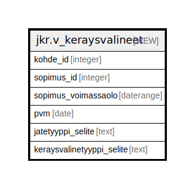

# jkr.v_keraysvalineet

## Description

Apunäkymä velvoitekyselyille. Sisältää mm. jätetyypin selitteen ja sopimuksen voimassaoloajan.

<details>
<summary><strong>Table Definition</strong></summary>

```sql
CREATE VIEW v_keraysvalineet AS (
 SELECT s.kohde_id,
    s.id AS sopimus_id,
    s.voimassaolo AS sopimus_voimassaolo,
    kv.pvm,
    jt.selite AS jatetyyppi_selite,
    kvt.selite AS keraysvalinetyyppi_selite
   FROM (((jkr.sopimus s
     JOIN jkr.keraysvaline kv ON ((s.id = kv.sopimus_id)))
     JOIN jkr_koodistot.jatetyyppi jt ON ((jt.id = s.jatetyyppi_id)))
     JOIN jkr_koodistot.keraysvalinetyyppi kvt ON ((kv.keraysvalinetyyppi_id = kvt.id)))
)
```

</details>

## Referenced Tables

- [jkr.sopimus](jkr.sopimus.md)
- [jkr.keraysvaline](jkr.keraysvaline.md)
- [jkr_koodistot.jatetyyppi](jkr_koodistot.jatetyyppi.md)
- [jkr_koodistot.keraysvalinetyyppi](jkr_koodistot.keraysvalinetyyppi.md)

## Columns

| Name | Type | Default | Nullable | Children | Parents | Comment |
| ---- | ---- | ------- | -------- | -------- | ------- | ------- |
| kohde_id | integer |  | true |  |  |  |
| sopimus_id | integer |  | true |  |  |  |
| sopimus_voimassaolo | daterange |  | true |  |  |  |
| pvm | date |  | true |  |  |  |
| jatetyyppi_selite | text |  | true |  |  |  |
| keraysvalinetyyppi_selite | text |  | true |  |  |  |

## Relations



---

> Generated by [tbls](https://github.com/k1LoW/tbls)
