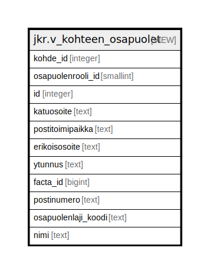

# jkr.v_kohteen_osapuolet

## Description

Näkymä joka "purkaa" kohteen osapuolten n:n relaation kullekin kohteelle 1:n relaatioksi.

<details>
<summary><strong>Table Definition</strong></summary>

```sql
CREATE VIEW v_kohteen_osapuolet AS (
 SELECT ko.kohde_id,
    ko.osapuolenrooli_id,
    op.id,
    op.katuosoite,
    op.postitoimipaikka,
    op.erikoisosoite,
    op.ytunnus,
    op.ulkoinen_id AS facta_id,
    op.postinumero,
    op.osapuolenlaji_koodi,
    op.nimi
   FROM (jkr.kohteen_osapuolet ko
     JOIN jkr.osapuoli op ON ((op.id = ko.osapuoli_id)))
)
```

</details>

## Referenced Tables

- [jkr.kohteen_osapuolet](jkr.kohteen_osapuolet.md)
- [jkr.osapuoli](jkr.osapuoli.md)

## Columns

| Name | Type | Default | Nullable | Children | Parents | Comment |
| ---- | ---- | ------- | -------- | -------- | ------- | ------- |
| kohde_id | integer |  | true |  |  |  |
| osapuolenrooli_id | smallint |  | true |  |  |  |
| id | integer |  | true |  |  |  |
| katuosoite | text |  | true |  |  |  |
| postitoimipaikka | text |  | true |  |  |  |
| erikoisosoite | text |  | true |  |  |  |
| ytunnus | text |  | true |  |  |  |
| facta_id | bigint |  | true |  |  |  |
| postinumero | text |  | true |  |  |  |
| osapuolenlaji_koodi | text |  | true |  |  |  |
| nimi | text |  | true |  |  |  |

## Relations



---

> Generated by [tbls](https://github.com/k1LoW/tbls)
