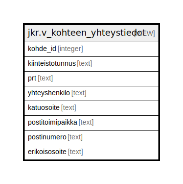

# jkr.v_kohteen_yhteystiedot

## Description

<details>
<summary><strong>Table Definition</strong></summary>

```sql
CREATE VIEW v_kohteen_yhteystiedot AS (
 SELECT k.id AS kohde_id,
    ( SELECT string_agg(jkr.pitka_kitu_2_lyhyt(r.kiinteistotunnus), ', '::text) AS string_agg
           FROM (jkr.kohteen_rakennukset kr
             JOIN jkr.rakennus r ON ((kr.rakennus_id = r.id)))
          WHERE (kr.kohde_id = k.id)) AS kiinteistotunnus,
    ( SELECT string_agg((r.prt)::text, ', '::text) AS string_agg
           FROM (jkr.kohteen_rakennukset kr
             JOIN jkr.rakennus r ON ((kr.rakennus_id = r.id)))
          WHERE (kr.kohde_id = k.id)) AS prt,
    op.nimi AS yhteyshenkilo,
    op.katuosoite,
    op.postitoimipaikka,
    op.postinumero,
    op.erikoisosoite
   FROM ((jkr.kohde k
     LEFT JOIN ( SELECT kohteen_osapuolet.kohde_id,
            kohteen_osapuolet.osapuoli_id,
            kohteen_osapuolet.osapuolenrooli_id
           FROM jkr.kohteen_osapuolet
          WHERE (kohteen_osapuolet.osapuolenrooli_id = ( SELECT osapuolenrooli.id
                   FROM jkr_koodistot.osapuolenrooli
                  WHERE (osapuolenrooli.selite = 'Yhteystieto'::text)))) ko ON ((k.id = ko.kohde_id)))
     LEFT JOIN jkr.osapuoli op ON ((op.id = ko.osapuoli_id)))
)
```

</details>

## Referenced Tables

- [jkr.kohteen_rakennukset](jkr.kohteen_rakennukset.md)
- [jkr.rakennus](jkr.rakennus.md)
- [jkr.kohde](jkr.kohde.md)
- [jkr.kohteen_osapuolet](jkr.kohteen_osapuolet.md)
- [jkr_koodistot.osapuolenrooli](jkr_koodistot.osapuolenrooli.md)
- [jkr.osapuoli](jkr.osapuoli.md)

## Columns

| Name | Type | Default | Nullable | Children | Parents | Comment |
| ---- | ---- | ------- | -------- | -------- | ------- | ------- |
| kohde_id | integer |  | true |  |  |  |
| kiinteistotunnus | text |  | true |  |  |  |
| prt | text |  | true |  |  |  |
| yhteyshenkilo | text |  | true |  |  |  |
| katuosoite | text |  | true |  |  |  |
| postitoimipaikka | text |  | true |  |  |  |
| postinumero | text |  | true |  |  |  |
| erikoisosoite | text |  | true |  |  |  |

## Relations



---

> Generated by [tbls](https://github.com/k1LoW/tbls)
