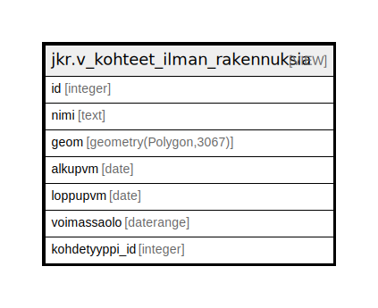

# jkr.v_kohteet_ilman_rakennuksia

## Description

<details>
<summary><strong>Table Definition</strong></summary>

```sql
CREATE VIEW v_kohteet_ilman_rakennuksia AS (
 SELECT k.id,
    k.nimi,
    k.geom,
    k.alkupvm,
    k.loppupvm,
    k.voimassaolo,
    k.kohdetyyppi_id
   FROM jkr.kohde k
  WHERE (NOT (EXISTS ( SELECT 1
           FROM jkr.kohteen_rakennukset kr
          WHERE (k.id = kr.kohde_id))))
)
```

</details>

## Referenced Tables

- [jkr.kohde](jkr.kohde.md)
- [jkr.kohteen_rakennukset](jkr.kohteen_rakennukset.md)

## Columns

| Name | Type | Default | Nullable | Children | Parents | Comment |
| ---- | ---- | ------- | -------- | -------- | ------- | ------- |
| id | integer |  | true |  |  |  |
| nimi | text |  | true |  |  |  |
| geom | geometry(Polygon,3067) |  | true |  |  |  |
| alkupvm | date |  | true |  |  |  |
| loppupvm | date |  | true |  |  |  |
| voimassaolo | daterange |  | true |  |  |  |
| kohdetyyppi_id | integer |  | true |  |  |  |

## Relations



---

> Generated by [tbls](https://github.com/k1LoW/tbls)
