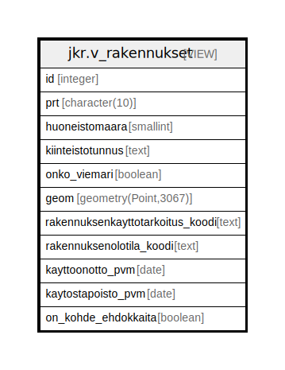

# jkr.v_rakennukset

## Description

Rakennusnäkymä, joka sisältää kaikki jkr.rakennus-taulun kentät sekä generoidun kentän onko rakennukselle tyrkyllä kohteita.

<details>
<summary><strong>Table Definition</strong></summary>

```sql
CREATE VIEW v_rakennukset AS (
 SELECT r.id,
    r.prt,
    r.huoneistomaara,
    r.kiinteistotunnus,
    r.onko_viemari,
    r.geom,
    r.rakennuksenkayttotarkoitus_koodi,
    r.rakennuksenolotila_koodi,
    r.kayttoonotto_pvm,
    r.kaytostapoisto_pvm,
    (EXISTS ( SELECT 1
           FROM jkr.kohteen_rakennusehdokkaat kr
          WHERE (r.id = kr.rakennus_id))) AS on_kohde_ehdokkaita
   FROM jkr.rakennus r
)
```

</details>

## Referenced Tables

- [jkr.kohteen_rakennusehdokkaat](jkr.kohteen_rakennusehdokkaat.md)
- [jkr.rakennus](jkr.rakennus.md)

## Columns

| Name | Type | Default | Nullable | Children | Parents | Comment |
| ---- | ---- | ------- | -------- | -------- | ------- | ------- |
| id | integer |  | true |  |  |  |
| prt | character(10) |  | true |  |  |  |
| huoneistomaara | smallint |  | true |  |  |  |
| kiinteistotunnus | text |  | true |  |  |  |
| onko_viemari | boolean |  | true |  |  |  |
| geom | geometry(Point,3067) |  | true |  |  |  |
| rakennuksenkayttotarkoitus_koodi | text |  | true |  |  |  |
| rakennuksenolotila_koodi | text |  | true |  |  |  |
| kayttoonotto_pvm | date |  | true |  |  |  |
| kaytostapoisto_pvm | date |  | true |  |  |  |
| on_kohde_ehdokkaita | boolean |  | true |  |  |  |

## Relations



---

> Generated by [tbls](https://github.com/k1LoW/tbls)
