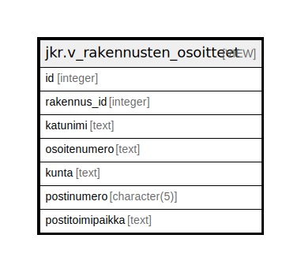

# jkr.v_rakennusten_osoitteet

## Description

Näkymä joka kokoaa kullekin rakennukselle osoitetauluista tiedot yhteen

<details>
<summary><strong>Table Definition</strong></summary>

```sql
CREATE VIEW v_rakennusten_osoitteet AS (
 SELECT o.id,
    o.rakennus_id,
    ka.katunimi_fi AS katunimi,
    o.osoitenumero,
    ku.nimi_fi AS kunta,
    po.numero AS postinumero,
    po.nimi_fi AS postitoimipaikka
   FROM (((jkr.osoite o
     JOIN jkr_osoite.katu ka ON ((o.katu_id = ka.id)))
     JOIN jkr_osoite.kunta ku ON ((ka.kunta_koodi = ku.koodi)))
     JOIN jkr_osoite.posti po ON ((o.posti_numero = po.numero)))
)
```

</details>

## Referenced Tables

- [jkr.osoite](jkr.osoite.md)
- [jkr_osoite.katu](jkr_osoite.katu.md)
- [jkr_osoite.kunta](jkr_osoite.kunta.md)
- [jkr_osoite.posti](jkr_osoite.posti.md)

## Columns

| Name | Type | Default | Nullable | Children | Parents | Comment |
| ---- | ---- | ------- | -------- | -------- | ------- | ------- |
| id | integer |  | true |  |  |  |
| rakennus_id | integer |  | true |  |  |  |
| katunimi | text |  | true |  |  |  |
| osoitenumero | text |  | true |  |  |  |
| kunta | text |  | true |  |  |  |
| postinumero | character(5) |  | true |  |  |  |
| postitoimipaikka | text |  | true |  |  |  |

## Relations



---

> Generated by [tbls](https://github.com/k1LoW/tbls)
