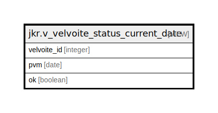

# jkr.v_velvoite_status_current_date

## Description

<details>
<summary><strong>Table Definition</strong></summary>

```sql
CREATE VIEW v_velvoite_status_current_date AS (
 SELECT velvoite_status.velvoite_id,
    velvoite_status.pvm,
    velvoite_status.ok
   FROM jkr.velvoite_status(CURRENT_DATE) velvoite_status(velvoite_id, pvm, ok)
)
```

</details>

## Referenced Tables

- [jkr.velvoite_status](jkr.velvoite_status.md)

## Columns

| Name | Type | Default | Nullable | Children | Parents | Comment |
| ---- | ---- | ------- | -------- | -------- | ------- | ------- |
| velvoite_id | integer |  | true |  |  |  |
| pvm | date |  | true |  |  |  |
| ok | boolean |  | true |  |  |  |

## Relations



---

> Generated by [tbls](https://github.com/k1LoW/tbls)
