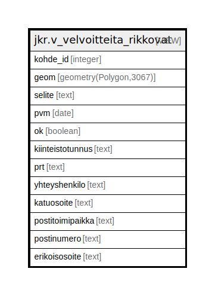

# jkr.v_velvoitteita_rikkovat

## Description

<details>
<summary><strong>Table Definition</strong></summary>

```sql
CREATE VIEW v_velvoitteita_rikkovat AS (
 SELECT k.id AS kohde_id,
    k.geom,
    vm.selite,
    vs.pvm,
    vs.ok,
    yht.kiinteistotunnus,
    yht.prt,
    yht.yhteyshenkilo,
    yht.katuosoite,
    yht.postitoimipaikka,
    yht.postinumero,
    yht.erikoisosoite
   FROM ((((jkr.kohde k
     JOIN jkr.velvoite v ON ((k.id = v.kohde_id)))
     JOIN ( SELECT velvoite_status.id,
            velvoite_status.pvm,
            velvoite_status.ok,
            velvoite_status.velvoite_id,
            velvoite_status.tallennuspvm,
            row_number() OVER (PARTITION BY velvoite_status.velvoite_id ORDER BY velvoite_status.pvm DESC) AS row_number
           FROM jkr.velvoite_status) vs ON (((v.id = vs.velvoite_id) AND (vs.row_number = 1))))
     JOIN jkr.velvoitemalli vm ON ((vm.id = v.velvoitemalli_id)))
     LEFT JOIN jkr.v_kohteen_yhteystiedot yht ON ((k.id = yht.kohde_id)))
  WHERE ((k.voimassaolo @> CURRENT_DATE) AND (NOT vs.ok))
)
```

</details>

## Referenced Tables

- [jkr.kohde](jkr.kohde.md)
- [jkr.velvoite](jkr.velvoite.md)
- [jkr.velvoite_status](jkr.velvoite_status.md)
- [jkr.velvoitemalli](jkr.velvoitemalli.md)
- [jkr.v_kohteen_yhteystiedot](jkr.v_kohteen_yhteystiedot.md)

## Columns

| Name | Type | Default | Nullable | Children | Parents | Comment |
| ---- | ---- | ------- | -------- | -------- | ------- | ------- |
| kohde_id | integer |  | true |  |  |  |
| geom | geometry(Polygon,3067) |  | true |  |  |  |
| selite | text |  | true |  |  |  |
| pvm | date |  | true |  |  |  |
| ok | boolean |  | true |  |  |  |
| kiinteistotunnus | text |  | true |  |  |  |
| prt | text |  | true |  |  |  |
| yhteyshenkilo | text |  | true |  |  |  |
| katuosoite | text |  | true |  |  |  |
| postitoimipaikka | text |  | true |  |  |  |
| postinumero | text |  | true |  |  |  |
| erikoisosoite | text |  | true |  |  |  |

## Relations



---

> Generated by [tbls](https://github.com/k1LoW/tbls)
