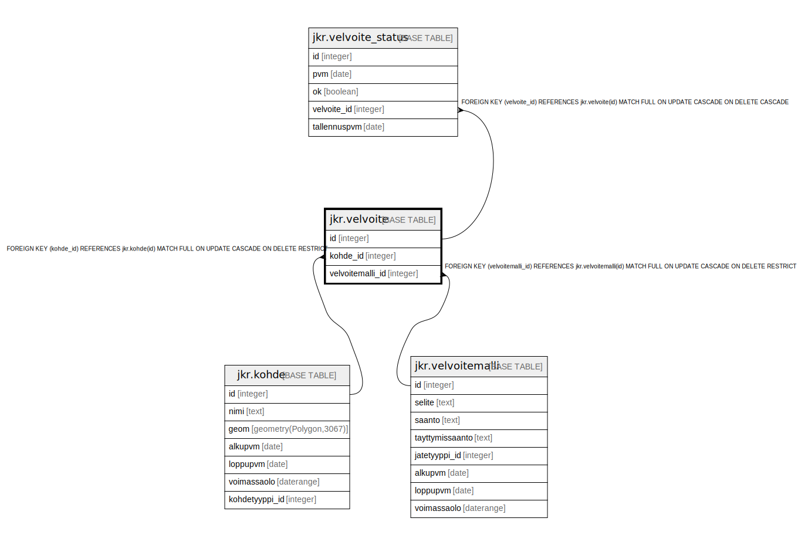

# jkr.velvoite

## Description

Taulu, joka sisältää kohteeseen liittyvät velvoitteet

## Columns

| Name | Type | Default | Nullable | Children | Parents | Comment |
| ---- | ---- | ------- | -------- | -------- | ------- | ------- |
| id | integer | nextval('jkr.velvoite_id_seq'::regclass) | false | [jkr.velvoite_status](jkr.velvoite_status.md) |  |  |
| kohde_id | integer |  | false |  | [jkr.kohde](jkr.kohde.md) |  |
| velvoitemalli_id | integer |  | false |  | [jkr.velvoitemalli](jkr.velvoitemalli.md) |  |

## Constraints

| Name | Type | Definition |
| ---- | ---- | ---------- |
| kohde_fk | FOREIGN KEY | FOREIGN KEY (kohde_id) REFERENCES jkr.kohde(id) MATCH FULL ON UPDATE CASCADE ON DELETE RESTRICT |
| velvoitemalli_fk | FOREIGN KEY | FOREIGN KEY (velvoitemalli_id) REFERENCES jkr.velvoitemalli(id) MATCH FULL ON UPDATE CASCADE ON DELETE RESTRICT |
| velvoite_pk | PRIMARY KEY | PRIMARY KEY (id) |

## Indexes

| Name | Definition |
| ---- | ---------- |
| velvoite_pk | CREATE UNIQUE INDEX velvoite_pk ON jkr.velvoite USING btree (id) |
| uidx_velvoite_kohde_id_velvoitemalli_id | CREATE UNIQUE INDEX uidx_velvoite_kohde_id_velvoitemalli_id ON jkr.velvoite USING btree (kohde_id, velvoitemalli_id) |
| idx_velvoite_velvoitemalli_id | CREATE INDEX idx_velvoite_velvoitemalli_id ON jkr.velvoite USING btree (velvoitemalli_id) |

## Relations

---

> Generated by [tbls](https://github.com/k1LoW/tbls)
