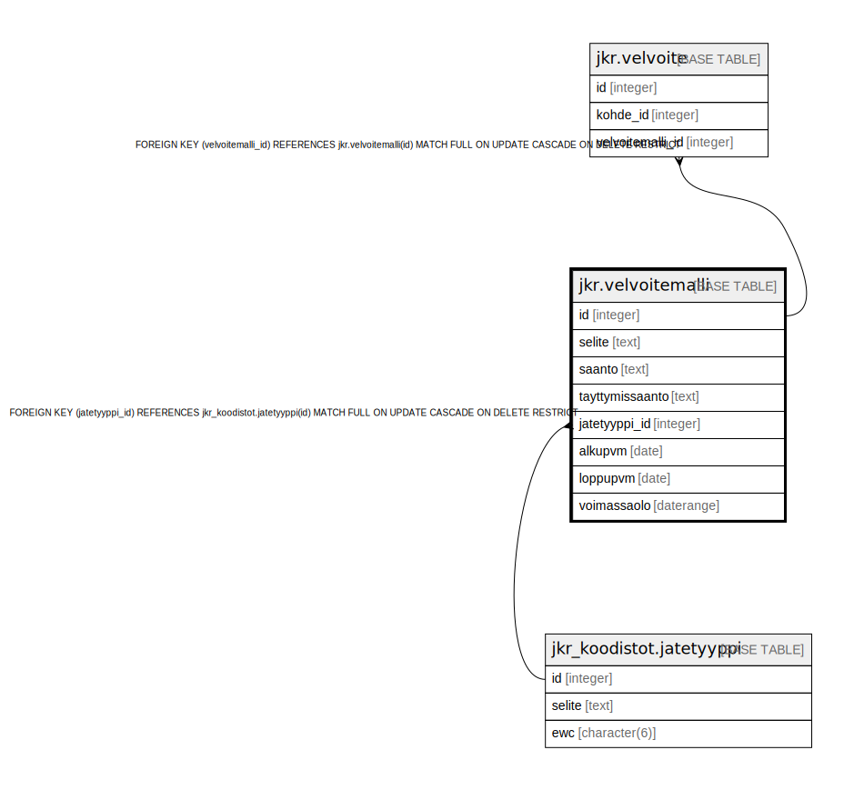

# jkr.velvoitemalli

## Description

Taulu, joka sisältää eri velvoitteet, ja niiden voimassaoloajan. Kullakin velvoitteella on näkymän ja funktion nimet, joilla velvoitteen täyttymistä voidaan seurata.

## Columns

| Name | Type | Default | Nullable | Extra Definition | Children | Parents | Comment |
| ---- | ---- | ------- | -------- | ---------------- | -------- | ------- | ------- |
| id | integer | nextval('jkr.velvoitemalli_id_seq'::regclass) | false |  | [jkr.velvoite](jkr.velvoite.md) |  |  |
| selite | text |  | true |  |  |  | Kuvaus tietyn tunnisteen omaavasta velvoitemallista |
| saanto | text |  | true |  |  |  | Näkymän nimi, joka palauttaa kohteet, joita tämä velvoite koskee. Näkymän tulee sijaita "jkr"-skeemassa. |
| tayttymissaanto | text |  | true |  |  |  | Funktion, joka palauttaa niiden kohteiden id:t, joilla velvoite täyttyy, nimi.<br>Funktio ottaa parametrina päivämäärän, jona velvoitteen täyttymistä tutkitaan. |
| jatetyyppi_id | integer |  | false |  |  | [jkr_koodistot.jatetyyppi](jkr_koodistot.jatetyyppi.md) |  |
| alkupvm | date |  | true |  |  |  | Velvoitteen alkupäivämäärä. Velvoitetta ei muodosteta kohteille, jotka eivät ole olleet olemassa velvoitteen voimassaolon aikana. |
| loppupvm | date |  | true |  |  |  | Velvoitteen loppupäivämäärä. Velvoitetta ei muodosteta kohteille, jotka eivät ole olleet olemassa velvoitteen voimassaolon aikana. |
| voimassaolo | daterange |  | true | GENERATED ALWAYS AS daterange(alkupvm, loppupvm, '[]'::text) STORED |  |  | Automaattisesti luotu aikaväli-kenttä velvoitteen voimassaololle.<br>Helpottaa aikavälikyselyitä. Voidaan esimerkiksi tehdä kysely<br>```sql<br>select *<br>from jkr.velvoitemalli<br>where voimassaolo @> '2021-1-1'::date<br>```<br>eikä tarvitse tehdä monimutkaista<br>```sql<br>select *<br>from jkr.velvoitemalli<br>where<br>  (alkupvm is null OR alkupvm <= '2021-1-1'::date`)<br>  AND<br>  (loppupvm is null OR '2021-1-1'::date` <= loppupvm)<br>``` |

## Constraints

| Name | Type | Definition |
| ---- | ---- | ---------- |
| velvoitemalli_pk | PRIMARY KEY | PRIMARY KEY (id) |
| jatetyyppi_fk | FOREIGN KEY | FOREIGN KEY (jatetyyppi_id) REFERENCES jkr_koodistot.jatetyyppi(id) MATCH FULL ON UPDATE CASCADE ON DELETE RESTRICT |

## Indexes

| Name | Definition |
| ---- | ---------- |
| velvoitemalli_pk | CREATE UNIQUE INDEX velvoitemalli_pk ON jkr.velvoitemalli USING btree (id) |
| uidx_velvoitemalli_selite | CREATE UNIQUE INDEX uidx_velvoitemalli_selite ON jkr.velvoitemalli USING btree (selite) |

## Relations



---

> Generated by [tbls](https://github.com/k1LoW/tbls)
