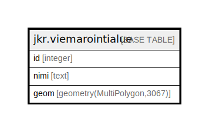

# jkr.viemarointialue

## Description

Aluerajaus, jolla on viemäröintiverkosto asennettu.  
Käytetään valitsemaan ne rakennukset, joilla tulisi olla lietteen keräys säiliöt.

## Columns

| Name | Type | Default | Nullable | Children | Parents | Comment |
| ---- | ---- | ------- | -------- | -------- | ------- | ------- |
| id | integer | nextval('jkr.viemarointialue_id_seq'::regclass) | false |  |  |  |
| nimi | text |  | true |  |  |  |
| geom | geometry(MultiPolygon,3067) |  | false |  |  |  |

## Constraints

| Name | Type | Definition |
| ---- | ---- | ---------- |
| viemarointialue_pk | PRIMARY KEY | PRIMARY KEY (id) |

## Indexes

| Name | Definition |
| ---- | ---------- |
| viemarointialue_pk | CREATE UNIQUE INDEX viemarointialue_pk ON jkr.viemarointialue USING btree (id) |
| idx_viemarointialue_geom | CREATE INDEX idx_viemarointialue_geom ON jkr.viemarointialue USING gist (geom) |

## Relations

---

> Generated by [tbls](https://github.com/k1LoW/tbls)
