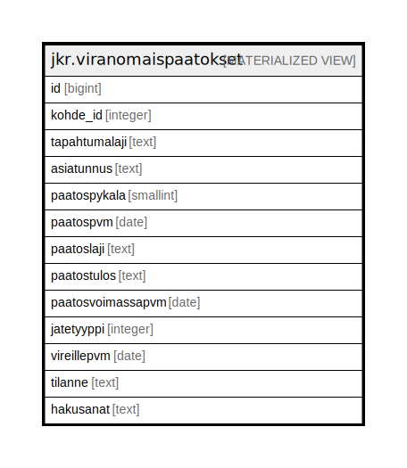

# jkr.viranomaispaatokset

## Description

<details>
<summary><strong>Table Definition</strong></summary>

```sql
CREATE MATERIALIZED VIEW viranomaispaatokset AS (
 WITH sample AS (
         SELECT foo.id,
            foo.kohde_id,
            foo.tapahtumalaji,
            foo.asiatunnus,
            foo.paatospykala,
            foo.paatospvm,
            foo.paatoslaji,
            foo.paatostulos,
            foo.paatosvoimassapvm,
            foo.jatetyyppi,
            foo.vireillepvm,
            foo.tilanne,
            foo.hakusanat
           FROM ( VALUES (NULL::bigint,NULL::integer,NULL::text,NULL::text,NULL::smallint,NULL::date,NULL::text,NULL::text,NULL::date,NULL::integer,NULL::date,NULL::text,NULL::text)) foo(id, kohde_id, tapahtumalaji, asiatunnus, paatospykala, paatospvm, paatoslaji, paatostulos, paatosvoimassapvm, jatetyyppi, vireillepvm, tilanne, hakusanat)
        )
 SELECT sample.id,
    sample.kohde_id,
    sample.tapahtumalaji,
    sample.asiatunnus,
    sample.paatospykala,
    sample.paatospvm,
    sample.paatoslaji,
    sample.paatostulos,
    sample.paatosvoimassapvm,
    sample.jatetyyppi,
    sample.vireillepvm,
    sample.tilanne,
    sample.hakusanat
   FROM sample
  WHERE (1 = 0)
)
```

</details>

## Referenced Tables

- VALUES

## Columns

| Name | Type | Default | Nullable | Children | Parents | Comment |
| ---- | ---- | ------- | -------- | -------- | ------- | ------- |
| id | bigint |  | true |  |  |  |
| kohde_id | integer |  | true |  |  |  |
| tapahtumalaji | text |  | true |  |  |  |
| asiatunnus | text |  | true |  |  |  |
| paatospykala | smallint |  | true |  |  |  |
| paatospvm | date |  | true |  |  |  |
| paatoslaji | text |  | true |  |  |  |
| paatostulos | text |  | true |  |  |  |
| paatosvoimassapvm | date |  | true |  |  |  |
| jatetyyppi | integer |  | true |  |  |  |
| vireillepvm | date |  | true |  |  |  |
| tilanne | text |  | true |  |  |  |
| hakusanat | text |  | true |  |  |  |

## Relations



---

> Generated by [tbls](https://github.com/k1LoW/tbls)
