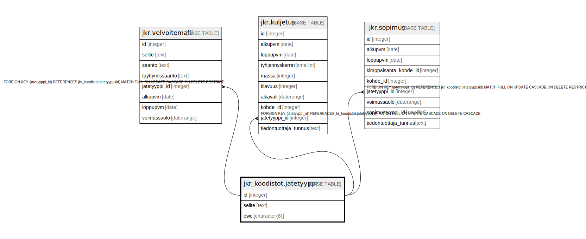

# jkr_koodistot.jatetyyppi

## Description

Taulu, joka sisältää mahdolliset jätetyypit

## Columns

| Name | Type | Default | Nullable | Children | Parents | Comment |
| ---- | ---- | ------- | -------- | -------- | ------- | ------- |
| id | integer | nextval('jkr_koodistot.jatetyyppi_id_seq'::regclass) | false | [jkr.velvoitemalli](jkr.velvoitemalli.md) [jkr.kuljetus](jkr.kuljetus.md) [jkr.sopimus](jkr.sopimus.md) |  |  |
| selite | text |  | false |  |  | Kuvaus tietyn tunnisteen omaavasta jätetyypistä |
| ewc | character(6) |  | true |  |  | Kuusinumeroinen jätekoodi (EWC-koodi) |

## Constraints

| Name | Type | Definition |
| ---- | ---- | ---------- |
| jatetyyppi_pk | PRIMARY KEY | PRIMARY KEY (id) |

## Indexes

| Name | Definition |
| ---- | ---------- |
| jatetyyppi_pk | CREATE UNIQUE INDEX jatetyyppi_pk ON jkr_koodistot.jatetyyppi USING btree (id) |
| jatetyyppi_selite_uidx | CREATE UNIQUE INDEX jatetyyppi_selite_uidx ON jkr_koodistot.jatetyyppi USING btree (selite) |

## Relations

---

> Generated by [tbls](https://github.com/k1LoW/tbls)
