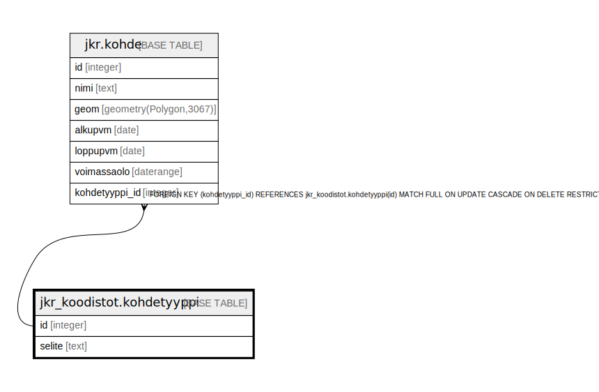

# jkr_koodistot.kohdetyyppi

## Description

Koodistotaulu kohteen tyypille.  
Kohdetyyppejä: Kiinteistö, Aluekeräyskohde, Pseudo aluekeräyskimppaisäntä

## Columns

| Name | Type | Default | Nullable | Children | Parents | Comment |
| ---- | ---- | ------- | -------- | -------- | ------- | ------- |
| id | integer | nextval('jkr_koodistot.kohdetyyppi_id_seq'::regclass) | false | [jkr.kohde](jkr.kohde.md) |  |  |
| selite | text |  | false |  |  | Kuvaus tietyn tunnisteen omaavasta kohdetyypistä |

## Constraints

| Name | Type | Definition |
| ---- | ---- | ---------- |
| kohdetyyppi_pk | PRIMARY KEY | PRIMARY KEY (id) |

## Indexes

| Name | Definition |
| ---- | ---------- |
| kohdetyyppi_pk | CREATE UNIQUE INDEX kohdetyyppi_pk ON jkr_koodistot.kohdetyyppi USING btree (id) |
| kohdetyyppi_selite_uidx | CREATE UNIQUE INDEX kohdetyyppi_selite_uidx ON jkr_koodistot.kohdetyyppi USING btree (selite) |

## Relations

---

> Generated by [tbls](https://github.com/k1LoW/tbls)
