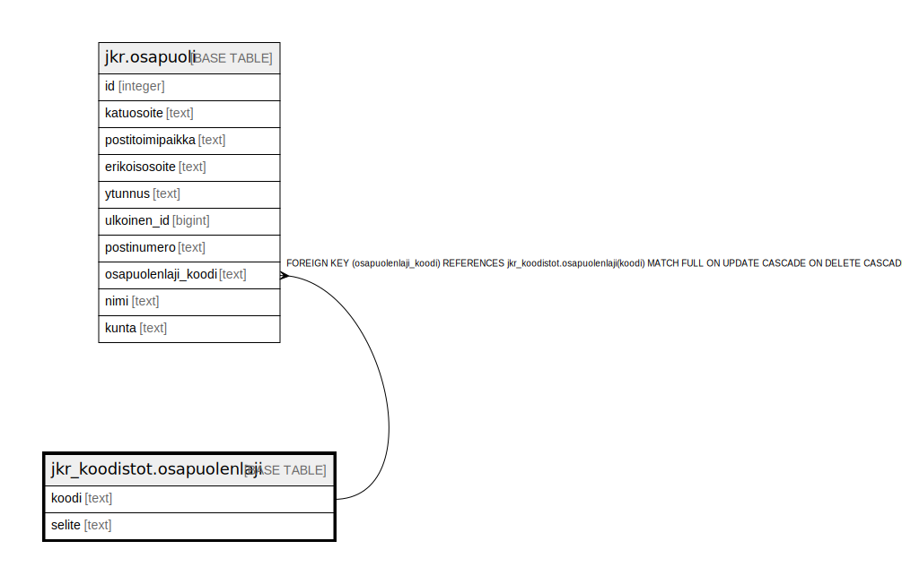

# jkr_koodistot.osapuolenlaji

## Description

Taulu, joka sisältää mahdolliset osapuolen lajit

## Columns

| Name | Type | Default | Nullable | Children | Parents | Comment |
| ---- | ---- | ------- | -------- | -------- | ------- | ------- |
| koodi | text |  | false | [jkr.osapuoli](jkr.osapuoli.md) |  | Taulun avaimena toimiva uniikki tekstimuotoinen tunniste |
| selite | text |  | false |  |  | Kuvaus tietyn tunnisteen omaavasta osapuolenlajista |

## Constraints

| Name | Type | Definition |
| ---- | ---- | ---------- |
| osapuolenlaji_pk | PRIMARY KEY | PRIMARY KEY (koodi) |

## Indexes

| Name | Definition |
| ---- | ---------- |
| uidx_osapuolenlaji_selite | CREATE UNIQUE INDEX uidx_osapuolenlaji_selite ON jkr_koodistot.osapuolenlaji USING btree (selite) |
| osapuolenlaji_pk | CREATE UNIQUE INDEX osapuolenlaji_pk ON jkr_koodistot.osapuolenlaji USING btree (koodi) |

## Relations

---

> Generated by [tbls](https://github.com/k1LoW/tbls)
