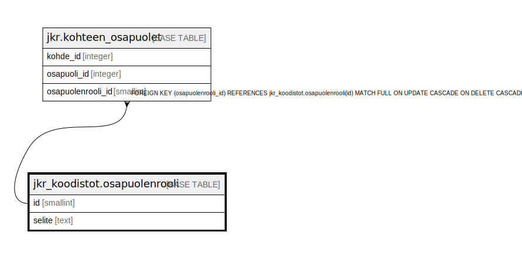

# jkr_koodistot.osapuolenrooli

## Description

Taulu sisältää koodiston kohteen osapuolen rooleille.  
Rooleja on tällä hetkellä Asiakas ja Yhteystieto

## Columns

| Name | Type | Default | Nullable | Children | Parents | Comment |
| ---- | ---- | ------- | -------- | -------- | ------- | ------- |
| id | smallint |  | false | [jkr.kohteen_osapuolet](jkr.kohteen_osapuolet.md) |  | Taulun avaimena toimiva uniikki kokonaislukutunniste. Tunniste generoidaan automaattisesti |
| selite | text |  | true |  |  | Kuvaus tietyn tunnisteen omaavasta osapuolenroolista |

## Constraints

| Name | Type | Definition |
| ---- | ---- | ---------- |
| osapuolenrooli_pk | PRIMARY KEY | PRIMARY KEY (id) |

## Indexes

| Name | Definition |
| ---- | ---------- |
| osapuolenrooli_pk | CREATE UNIQUE INDEX osapuolenrooli_pk ON jkr_koodistot.osapuolenrooli USING btree (id) |

## Relations

---

> Generated by [tbls](https://github.com/k1LoW/tbls)
