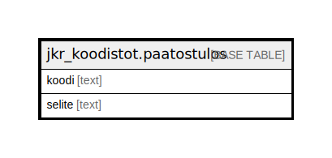

# jkr_koodistot.paatostulos

## Description

## Columns

| Name | Type | Default | Nullable | Children | Parents | Comment |
| ---- | ---- | ------- | -------- | -------- | ------- | ------- |
| koodi | text |  | false |  |  |  |
| selite | text |  | true |  |  |  |

## Constraints

| Name | Type | Definition |
| ---- | ---- | ---------- |
| paatostulos_pk | PRIMARY KEY | PRIMARY KEY (koodi) |

## Indexes

| Name | Definition |
| ---- | ---------- |
| paatostulos_pk | CREATE UNIQUE INDEX paatostulos_pk ON jkr_koodistot.paatostulos USING btree (koodi) |

## Relations

---

> Generated by [tbls](https://github.com/k1LoW/tbls)
