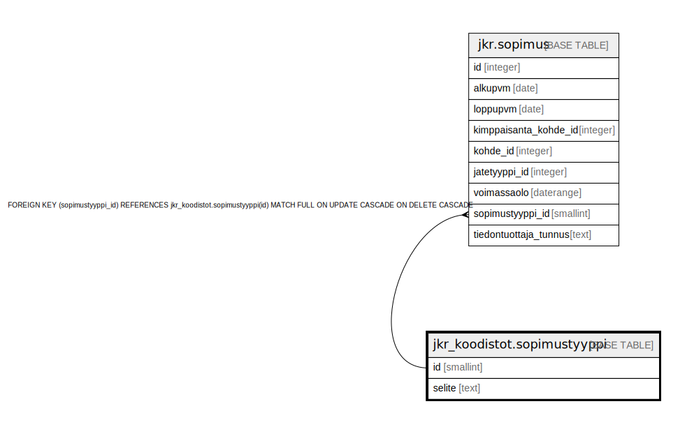

# jkr_koodistot.sopimustyyppi

## Description

Koodistotaulu sopimustyypeille.  
Sopimustyyppejä: Tyhjennyssopimus, Kimppasopimus, Aluekeräyssopimus

## Columns

| Name | Type | Default | Nullable | Children | Parents | Comment |
| ---- | ---- | ------- | -------- | -------- | ------- | ------- |
| id | smallint |  | false | [jkr.sopimus](jkr.sopimus.md) |  | Taulun avaimena toimiva uniikki kokonaislukutunniste. Tunniste generoidaan automaattisesti |
| selite | text |  | true |  |  | Kuvaus tietyn tunnisteen omaavasta sopimustyypistä |

## Constraints

| Name | Type | Definition |
| ---- | ---- | ---------- |
| sopimustyyppi_pk | PRIMARY KEY | PRIMARY KEY (id) |

## Indexes

| Name | Definition |
| ---- | ---------- |
| sopimustyyppi_pk | CREATE UNIQUE INDEX sopimustyyppi_pk ON jkr_koodistot.sopimustyyppi USING btree (id) |
| uidx_selite | CREATE UNIQUE INDEX uidx_selite ON jkr_koodistot.sopimustyyppi USING btree (selite) |

## Relations

---

> Generated by [tbls](https://github.com/k1LoW/tbls)
