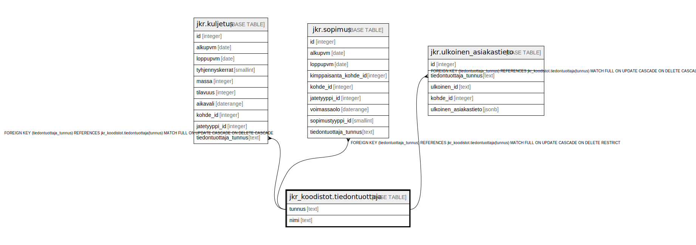

# jkr_koodistot.tiedontuottaja

## Description

Taulu, joka sisältää mahdolliset tiedontuottajat

## Columns

| Name | Type | Default | Nullable | Children | Parents | Comment |
| ---- | ---- | ------- | -------- | -------- | ------- | ------- |
| tunnus | text |  | false | [jkr.kuljetus](jkr.kuljetus.md) [jkr.sopimus](jkr.sopimus.md) [jkr.ulkoinen_asiakastieto](jkr.ulkoinen_asiakastieto.md) |  | Taulun avaimena toimiva uniikki tekstimuotoinen tunniste |
| nimi | text |  | false |  |  | Tiedontuottajan nimi |

## Constraints

| Name | Type | Definition |
| ---- | ---- | ---------- |
| tiedontuottaja_pk | PRIMARY KEY | PRIMARY KEY (tunnus) |

## Indexes

| Name | Definition |
| ---- | ---------- |
| nimi_uidx | CREATE UNIQUE INDEX nimi_uidx ON jkr_koodistot.tiedontuottaja USING btree (nimi) |
| tiedontuottaja_pk | CREATE UNIQUE INDEX tiedontuottaja_pk ON jkr_koodistot.tiedontuottaja USING btree (tunnus) |
| tunnus_uidx | CREATE UNIQUE INDEX tunnus_uidx ON jkr_koodistot.tiedontuottaja USING btree (tunnus) |

## Relations

---

> Generated by [tbls](https://github.com/k1LoW/tbls)
