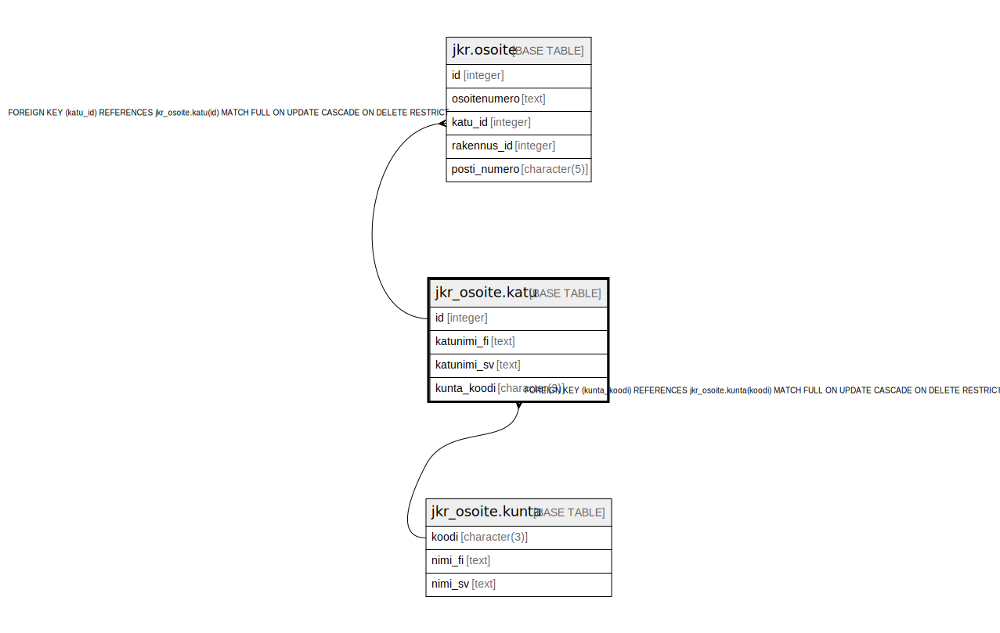

# jkr_osoite.katu

## Description

Katuosoitteen tiedot sisältävä taulu

## Columns

| Name | Type | Default | Nullable | Children | Parents | Comment |
| ---- | ---- | ------- | -------- | -------- | ------- | ------- |
| id | integer | nextval('jkr_osoite.katu_id_seq'::regclass) | false | [jkr.osoite](jkr.osoite.md) |  |  |
| katunimi_fi | text |  | true |  |  | Kadun nimi suomeksi |
| katunimi_sv | text |  | true |  |  | Kadun nimi ruotsiksi |
| kunta_koodi | character(3) |  | false |  | [jkr_osoite.kunta](jkr_osoite.kunta.md) |  |

## Constraints

| Name | Type | Definition |
| ---- | ---- | ---------- |
| katu_pk | PRIMARY KEY | PRIMARY KEY (id) |
| kunta_fk | FOREIGN KEY | FOREIGN KEY (kunta_koodi) REFERENCES jkr_osoite.kunta(koodi) MATCH FULL ON UPDATE CASCADE ON DELETE RESTRICT |

## Indexes

| Name | Definition |
| ---- | ---------- |
| katu_pk | CREATE UNIQUE INDEX katu_pk ON jkr_osoite.katu USING btree (id) |
| katunimi_fi_idx | CREATE UNIQUE INDEX katunimi_fi_idx ON jkr_osoite.katu USING btree (kunta_koodi, katunimi_fi) |
| katunimi_sv_idx | CREATE UNIQUE INDEX katunimi_sv_idx ON jkr_osoite.katu USING btree (kunta_koodi, katunimi_sv) |
| idx_katu_kunta_koodi | CREATE INDEX idx_katu_kunta_koodi ON jkr_osoite.katu USING btree (kunta_koodi) |

## Relations

---

> Generated by [tbls](https://github.com/k1LoW/tbls)
