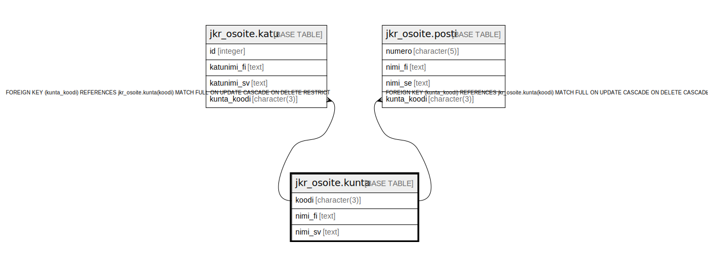

# jkr_osoite.kunta

## Description

Osoitteeseen liittyvän kunnan tiedot sisältävä taulu

## Columns

| Name | Type | Default | Nullable | Children | Parents | Comment |
| ---- | ---- | ------- | -------- | -------- | ------- | ------- |
| koodi | character(3) |  | false | [jkr_osoite.katu](jkr_osoite.katu.md) [jkr_osoite.posti](jkr_osoite.posti.md) |  | Kolminumeroinen kuntakoodi |
| nimi_fi | text |  | true |  |  | Kunnan nimi suomeksi |
| nimi_sv | text |  | true |  |  | Kunnan nimi ruotsiksi |

## Constraints

| Name | Type | Definition |
| ---- | ---- | ---------- |
| kunta_pk | PRIMARY KEY | PRIMARY KEY (koodi) |

## Indexes

| Name | Definition |
| ---- | ---------- |
| kunta_pk | CREATE UNIQUE INDEX kunta_pk ON jkr_osoite.kunta USING btree (koodi) |

## Relations

---

> Generated by [tbls](https://github.com/k1LoW/tbls)
