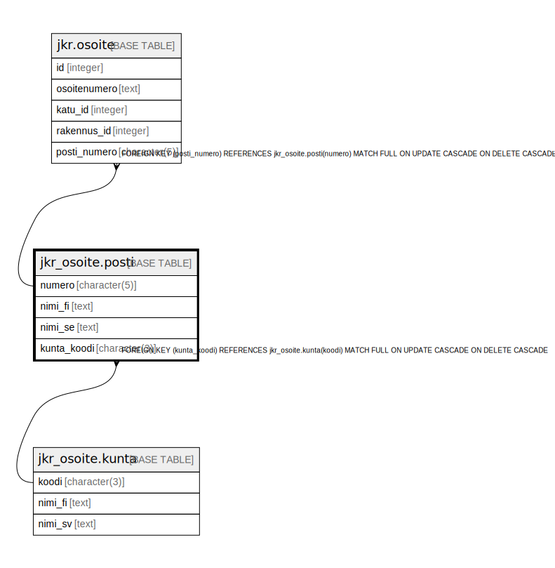

# jkr_osoite.posti

## Description

Postitoimipaikan tiedot sisältävä taulu

## Columns

| Name | Type | Default | Nullable | Children | Parents | Comment |
| ---- | ---- | ------- | -------- | -------- | ------- | ------- |
| numero | character(5) |  | false | [jkr.osoite](jkr.osoite.md) |  | Taulun avaimena toimiva uniikki viisinumeroinen postinumero |
| nimi_fi | text |  | true |  |  | Postitoimipaikan nimi suomeksi |
| nimi_se | text |  | true |  |  | Postitoimipaikan nimi ruotsiksi |
| kunta_koodi | character(3) |  | false |  | [jkr_osoite.kunta](jkr_osoite.kunta.md) |  |

## Constraints

| Name | Type | Definition |
| ---- | ---- | ---------- |
| kunta_fk | FOREIGN KEY | FOREIGN KEY (kunta_koodi) REFERENCES jkr_osoite.kunta(koodi) MATCH FULL ON UPDATE CASCADE ON DELETE CASCADE |
| posti_pk | PRIMARY KEY | PRIMARY KEY (numero) |

## Indexes

| Name | Definition |
| ---- | ---------- |
| posti_pk | CREATE UNIQUE INDEX posti_pk ON jkr_osoite.posti USING btree (numero) |
| idx_posti_kunta_koodi | CREATE INDEX idx_posti_kunta_koodi ON jkr_osoite.posti USING btree (kunta_koodi) |

## Relations

---

> Generated by [tbls](https://github.com/k1LoW/tbls)
