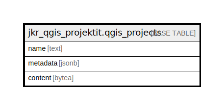

# jkr_qgis_projektit.qgis_projects

## Description

QGIS-projektit sisältävä taulu

## Columns

| Name | Type | Default | Nullable | Children | Parents | Comment |
| ---- | ---- | ------- | -------- | -------- | ------- | ------- |
| name | text |  | false |  |  | QGIS-projektin nimi |
| metadata | jsonb |  | true |  |  | QGIS-projektin metadatatiedot jsonb-muodossa |
| content | bytea |  | true |  |  | QGIS-projektitiedosto. Tämän kentän sisältö on tarkoitettu ainoastaan QGISin käyttöön. |

## Constraints

| Name | Type | Definition |
| ---- | ---- | ---------- |
| qgis_projects_pkey | PRIMARY KEY | PRIMARY KEY (name) |

## Indexes

| Name | Definition |
| ---- | ---------- |
| qgis_projects_pkey | CREATE UNIQUE INDEX qgis_projects_pkey ON jkr_qgis_projektit.qgis_projects USING btree (name) |

## Relations

---

> Generated by [tbls](https://github.com/k1LoW/tbls)
